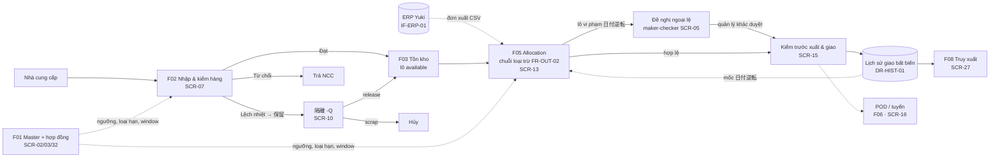

# 1. Tổng quan hệ thống & phạm vi thiết kế

## 1.1 Mục tiêu hệ thống

YCCMS quản lý dòng hàng của một trung tâm kho lạnh 3 dải nhiệt (常温 / 冷蔵 / 冷凍). Luồng đi từ lúc **nhận hàng**, qua **lưu kho**, đến lúc **giao cho khách bán lẻ**. Hệ thống phải bảo đảm 4 điều mà hiện Yuki đang kiểm bằng tay và bảng tính:

1. **Không giao hàng đã đến 消費期限** (hard stop, ghi lại bất biến).
2. **Không giao cho khách lô có hạn sớm hơn lô khách đó đã nhận** (日付逆転禁止, theo từng cặp khách × SKU). Ngoại lệ chỉ được phép khi có hai người: một người lập đề nghị, một người khác duyệt.
3. **Hàng sai nhiệt hoặc chờ QA bị khóa** trong khu 隔離 cho tới khi có quyết định.
4. **Truy được nguồn gốc** từ lô ra khách và ngược lại. Gạo (産地・取引) và bò (mã cá thể 10 số) là nghĩa vụ pháp định.

## 1.2 Tác nhân và vai trò

| Vai trò hệ thống | Nhóm nhân sự RFP | Số người (RFP) | Việc chính trên YCCMS |
|---|---|---|---|
| `warehouse` — Nhân viên kho | 倉庫作業者 | 18 | Kiểm nhập, xem tồn, chuẩn bị xuất, chọn lô, xác nhận giao, lập đề nghị ngoại lệ 日付逆転 |
| `manager` — Quản lý kho | 倉庫管理者 | (trong 18 + 3 admin) | Mọi việc của `warehouse` + duyệt ngoại lệ của **người khác**, chốt delivery window, sửa ngưỡng nhiệt / loại hạn SKU, release / scrap lô 隔離 |
| `qa` — QA | 品質管理 | 3 | Quyết định 隔離 (release/scrap), xem truy xuất, audit |
| `sales` — Sales/CS | 営業・CS | 3 | Xem đơn, hợp đồng khách-SKU, lịch sử giao |
| `admin` — Quản trị | システム管理 | 2 IT + 3 admin | Quản lý người dùng/vai trò, master, cấu hình |
| `driver`, `dispatcher` | 運転者 9, 配車計画 4 | 13 | Thuộc module F06/POD, ngoài phạm vi chi tiết của bản này |
| `auditor` (chỉ đọc) | Kiểm toán nội bộ | — | Đọc audit log, xuất bằng chứng |

**[Prototype khác]** Prototype chỉ có 2 vai trò `warehouse` và `manager`; QA và admin được gộp vào `manager`. Hệ thống đích dùng bảng `roles` / `user_roles` (một người có thể giữ nhiều vai trò). Chi tiết ở `05-database/02-prototype-vs-design-comparison.md`.

## 1.3 Danh sách module

| Mã | Module | Mức thiết kế ở LAB-4 | Màn hình chính |
|---|---|---|---|
| F01 | Master & hợp đồng khách-SKU | **Chi tiết** | SCR-02, SCR-03 |
| F02 | Nhập kho & kiểm hàng | **Chi tiết** | SCR-07 |
| F03 | Tồn kho & 隔離, cấu hình ngưỡng nhiệt | **Chi tiết** | SCR-08, SCR-10, SCR-32 |
| F05 | Xuất kho, allocation, kiểm trước xuất | **Chi tiết** | SCR-12, SCR-13, SCR-15 |
| F05/F01 | Cảnh báo 日付逆転 + hàng chờ duyệt (maker-checker) | **Chi tiết** | SCR-05 (+ màn cảnh báo bổ sung) |
| F08 | Truy xuất nguồn gốc | **Chi tiết** (truy xuôi/ngược) | SCR-27 |
| F11 | Đăng nhập, phân quyền, audit | **Chi tiết** (đăng nhập, audit) · kiến trúc (quản lý người dùng) | SCR-00, SCR-34 |
| F09 | Dashboard | **Chi tiết** | SCR-01 |
| F06 | Lập tuyến & giờ lái 2024 | Kiến trúc | SCR-18..21 |
| F07 | Logger nhiệt & HACCP | Kiến trúc | SCR-22..26 |
| F08 | Recall | Kiến trúc | SCR-28, 29 |
| F05 | POD 車上渡し / 軒先渡し | Kiến trúc | SCR-16 |
| F10 | Tích hợp ERP / logger / map / IdP / mail | Kiến trúc (ranh giới giao diện) | SCR-35, 36 |
| F12 | Migration | Kiến trúc | SCR-37..39 |

## 1.4 Vì sao chỉ thiết kế chi tiết các module trên

| Lý do | Giải thích |
|---|---|
| Đã kiểm chứng bằng prototype | 14 màn lõi đã chạy thật trên Supabase, qua 26 test hồi quy SQL và 7 kịch bản E2E. Đặc tả lấy từ hành vi đã chạy, không đoán |
| Rủi ro nghiệp vụ dồn ở đây | Các "lỗi nghiêm trọng bị trừ điểm" của RFP (S5-03) đều thuộc chuỗi nhập → tồn → allocation → giao: nhầm 賞味/消費, so 日付逆転 với hôm nay, gọi 1/3 là luật |
| Module còn lại thiếu đầu vào | F06 cần license mapping service (IF-MAP-01 — Assumption); F07 cần định dạng CSV logger DL-A01/C01/F01; POD cần chốt thiết bị; ERP cần đặc tả từ Yuki. Thiết kế chi tiết lúc này sẽ phải làm lại |
| Vẫn giữ chỗ trong kiến trúc | Sơ đồ kiến trúc và ER có điểm nối (bảng, adapter) cho các module này để phần lõi không phải sửa khi thêm vào |

## 1.5 Luồng nghiệp vụ tổng thể

## 1.6 Ràng buộc và giả định chính

| Loại | Nội dung | Nguồn |
|---|---|---|
| Quy mô | 1 DC · 12 SKU fixture · 80 người dùng đồng thời · ~1.800 dòng nhập + ~7.200 dòng xuất/tháng | RFP S1, NFR-PERF-01 |
| Hiệu năng | p95 đọc ≤ 2s, ghi ≤ 3s ở 80 user; truy xuất 3 năm ≤ 60s trên 300.000 dòng giao | NFR-PERF-01/02 |
| Liên tục | AVL 99.5%/tháng trong 05:00–23:00 JST; RTO 4h / RPO 15′ | NFR-AVL-01, NFR-BCP-01 |
| Bảo mật | SSO + MFA cho quyền cao; RBAC tối thiểu quyền; maker-checker; secret không nằm trong mã nguồn | NFR-SEC-01..03 |
| Audit | Event append-only cho trạng thái/master/duyệt/export/đăng nhập | NFR-AUD-01 |
| Bản địa | UI, thông báo lỗi, báo cáo tiếng Nhật + JST | NFR-LOC-01 |
| Lưu trữ | 3 năm cho nhập/xuất/nhiệt/deviation/truy xuất | DR-RET-01 |
| Lịch | Bắt đầu 2026-10-05 · thiết kế cơ bản 8 tuần · go-live 2027-06-01 | RFP timeline |

**[Prototype khác]** UI prototype là tiếng Việt + thuật ngữ Nhật để đội Sun và khách cùng đọc. Hệ thống đích chuyển sang tiếng Nhật, nên đặc tả màn hình ghi nhãn ở dạng `Nhãn VN / 日本語`.

## 1.7 Câu hỏi mở ảnh hưởng thiết kế

| # | Câu hỏi | Thiết kế tạm chọn | Chỗ bị ảnh hưởng |
|---|---|---|---|
| Q1 | 日付逆転 so theo **khách** hay theo **từng cửa hàng/điểm giao**? | Theo khách (đúng chữ RFP); ER đã có `customer_sites` để chuyển sang theo cửa hàng mà không đổi cấu trúc | ER, BR-DATE-01, SCR-13 |
| Q2 | Mốc "最後に受け入れた配送" là **lần giao gần nhất** hay **hạn lớn nhất đã giao**? | Hạn lớn nhất (chặt hơn; hai cách chỉ khác sau khi đã duyệt một ngoại lệ) | `last_deliveries`, ADR-003 |
| Q3 | Mã bò chỉ có 9 số: chặn nhận hay cho 保留 vào 隔離 chờ business-review? | Đích: 保留 + trạng thái lô `review`. Prototype đang chặn nhận | SCR-07, máy trạng thái lô |
| Q4 | Duyệt ngoại lệ 日付逆転 có cần 2 cấp? Ai được duyệt? | 1 cấp, vai trò `manager`, khác người lập | SCR-05, ADR-003 |
| Q5 | Ai chốt delivery window cho AGR-008 / AGR-014, khi nào? | Quản lý chốt trên SCR-03, qua maker-checker ở bản đích | SCR-03 |
