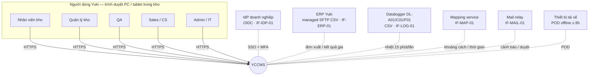
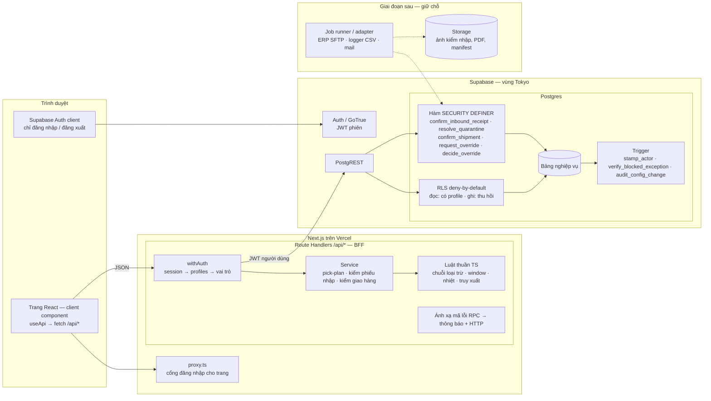
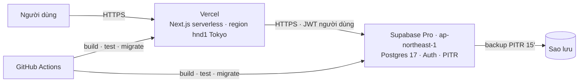
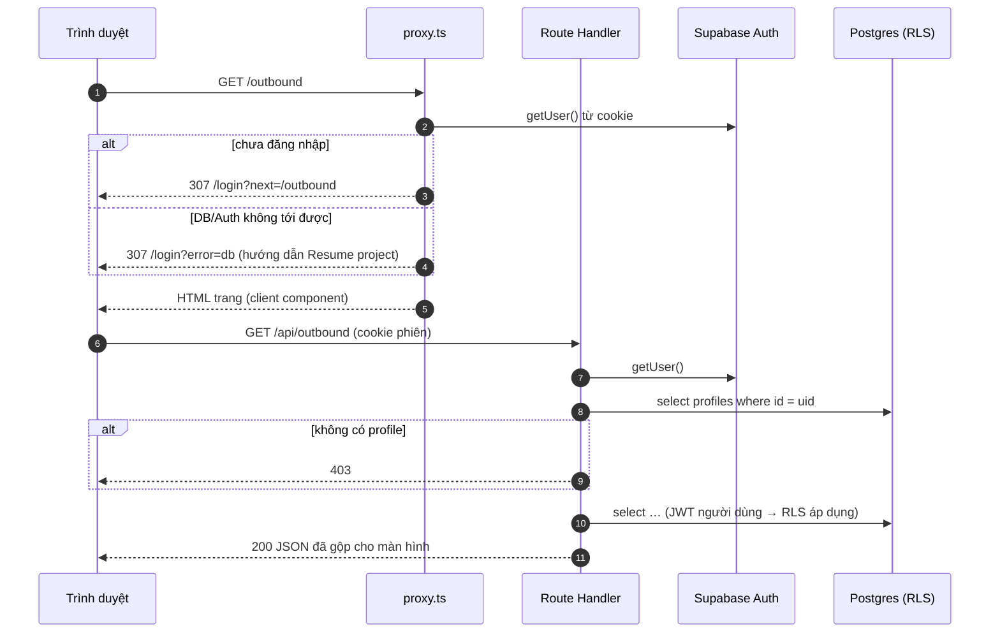
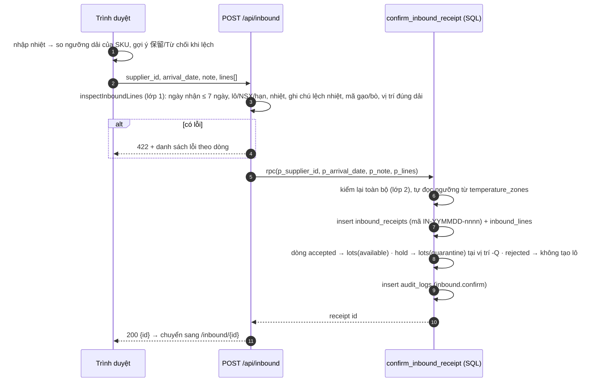
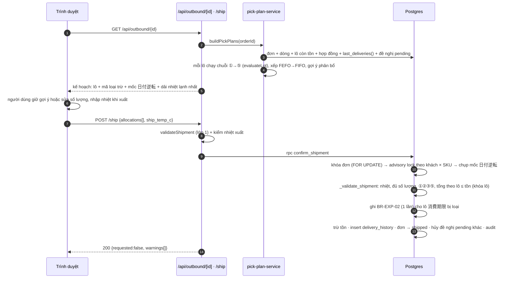
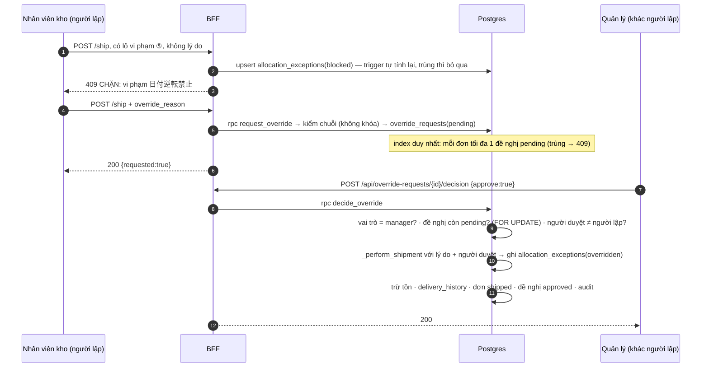

# 2. Thiết kế kiến trúc & luồng dữ liệu

## 2.1 Sơ đồ ngữ cảnh

Sơ đồ cho biết YCCMS nói chuyện với ai. Nét liền là phần có trong bản thiết kế chi tiết, nét đứt là ranh giới giao diện đã giữ chỗ (Assumption hoặc module sau).

## 2.2 Kiến trúc logic

Kiến trúc có 3 tầng. Luật cứng của nghiệp vụ nằm ở tầng dữ liệu: ①②③⑤, maker-checker, tồn kho, nhiệt khi nhập/xuất. Dù tầng trên có lỗi, các luật này vẫn không bị lách (xem ADR-001). **Giới hạn ở prototype:** giá trị cấu hình (ngưỡng nhiệt, ngưỡng cận hạn, window) chỉ được kiểm ở BFF. Manager gọi thẳng PostgREST vẫn ghi được giá trị vô lý như min > max hay đưa window về NULL, và mọi người có profile đều chèn được dòng audit với nội dung tùy ý (chỉ người thực hiện là bị đóng dấu đúng). Bản đích thêm CHECK và bỏ quyền INSERT `audit_logs` (xem `05-database/02` D-21, D-22).

| Tầng | Trách nhiệm | Không làm |
|---|---|---|
| Trình duyệt | Hiển thị, nhập liệu, tính trước để báo lỗi sớm (màu nhiệt, gợi ý trạng thái) | Không giữ khóa bí mật, không gọi bảng Supabase trực tiếp (trừ Auth) |
| Route Handler (BFF) | Xác thực phiên, kiểm vai trò, kiểm dữ liệu (lớp 1), dựng kế hoạch lấy hàng, gộp dữ liệu cho màn hình, đổi mã lỗi DB thành thông báo | Không dùng service role, không ghi bảng nghiệp vụ trực tiếp |
| Hàm SQL (RPC) | Kiểm lại toàn bộ luật cứng (lớp 2, quyết định cuối cùng), khóa, ghi nhiều bảng trong 1 giao dịch, ghi audit | Không tin dữ liệu client gửi lên: tự đọc lại master, ngưỡng, lịch sử |
| RLS + trigger | Chặn đọc khi chưa có hồ sơ, chặn ghi trực tiếp, tự đóng dấu người thực hiện, tự ghi audit thay đổi cấu hình | — |

## 2.3 Sơ đồ triển khai

| Môi trường | Vercel | Supabase | Dữ liệu |
|---|---|---|---|
| dev | Preview deployment theo nhánh | Project dev | Seed mock (fixture RFP) |
| staging | Preview gắn nhánh `release/*` | Project staging | Dữ liệu migration rehearsal (đã ẩn danh nếu cần) |
| prod | Production | Project prod, gói Pro, PITR | Dữ liệu thật |

Biến môi trường: trên Vercel chỉ có `NEXT_PUBLIC_SUPABASE_URL` và `NEXT_PUBLIC_SUPABASE_PUBLISHABLE_KEY`. Khóa `sb_secret_…` và chuỗi kết nối DB chỉ dùng trong pipeline migration (secret của CI) và máy dev.

**[Prototype khác]** Prototype chạy trên Supabase Free (tự pause sau ~7 ngày không dùng, không PITR) và Vercel Hobby. Region của Vercel chưa ghim trong repo (không có `vercel.json`). Vercel project chưa nối Git, deploy bằng `npx vercel deploy --prod`. Migration chạy bằng `npm run db:setup` từ máy dev, chưa có CI.

## 2.4 Cấu trúc mã nguồn theo tầng

| Thư mục (`yccms-prototype/`) | Tầng | Ghi chú thiết kế |
|---|---|---|
| `src/proxy.ts` | Cổng trang | Next.js 16 đổi `middleware` → `proxy`; matcher bỏ qua `api/` vì API tự trả 401 |
| `src/app/login`, `src/app/(app)/**/page.tsx` | UI | Client component, dữ liệu lấy qua `useApi` |
| `src/app/api/**/route.ts` | BFF | Mỗi route bọc `withAuth`; route ghi gọi RPC |
| `src/lib/api/` | BFF | `withAuth`, `ApiError`, `assertNoDbError`, ánh xạ mã lỗi RPC |
| `src/lib/services/` | BFF | `pick-plan-service` dùng chung cho màn xuất kho, cảnh báo, dashboard, API giao hàng |
| `src/lib/rules/` | Thuần (dùng được ở client + server) | Luật nghiệp vụ không phụ thuộc I/O, có unit test |
| `supabase/migrations/` | Dữ liệu | `0001` schema · `0002` RLS + trigger · `0003` nhập kho · `0004` xuất kho · `0005` hàm đọc |
| `supabase/tests/` | Dữ liệu | Test hồi quy bảo mật SQL, chạy trong giao dịch rồi rollback |

## 2.5 Các lớp bảo mật (phòng thủ nhiều lớp)

| Lớp | Cơ chế | Chặn được gì | Bằng chứng ở prototype |
|---|---|---|---|
| L1 Cổng trang | `proxy.ts` chuyển mọi trang (trừ `/login`) về `/login?next=…` khi chưa có phiên | Người lạ mở URL bất kỳ | E2E: mở trang bị chuyển về `/login` (curl trên production: 307) |
| L2 Cổng API | `withAuth`: không phiên → 401; không có `profiles` → 403; DB không tới được → 503 | Gọi API trực tiếp bằng curl | API trả 401 trên production |
| L3 Vai trò ở BFF | Route cấu hình kiểm `profile.role === 'manager'` | Nhân viên kho sửa cấu hình qua API | 403 "Chỉ quản lý…" |
| L4 RLS | Đọc: `app_role() is not null`. Ghi: thu hồi insert/update/delete trên mọi bảng; chỉ mở UPDATE theo **cột** cấu hình cho manager | Gọi thẳng PostgREST bằng anon key + JWT | 26 test SQL (`npm run db:test`) |
| L5 Hàm SQL | `SECURITY DEFINER`, `search_path` cố định, tự kiểm `auth.uid()` + vai trò + luật; hàm nội bộ `_validate_shipment` / `_perform_shipment` không cấp execute | Lách lớp BFF, tự duyệt (`SELF_APPROVAL`), giao lô 消費期限 | Test: `NO_PROFILE`, `SELF_APPROVAL`, `USE_BY_EXPIRED` |
| L6 Trigger toàn vẹn log | `stamp_actor` lấy người thực hiện từ JWT; `verify_blocked_exception` tự tính lại nội dung lượt chặn; `audit_config_change` ghi trước → sau | Giả mạo người thực hiện, ghi lượt chặn giả, sửa cấu hình không để lại dấu. **Chưa chặn:** nội dung (`action`, `detail`) của dòng audit chèn trực tiếp qua policy `audit_insert` | Test: actor bị ghi đè đúng người gọi |
| L7 (đích) SSO + MFA | OIDC với IdP của Yuki, MFA cho `manager`/`admin`/`qa` | Lộ mật khẩu | **[Prototype khác]** email + mật khẩu Supabase, tắt đăng ký mới |

## 2.6 Luồng dữ liệu

### 2.6.1 Mở trang và đọc dữ liệu (mọi màn)

### 2.6.2 Kiểm nhập (SCR-07)

### 2.6.3 Allocation và giao hàng bình thường (SCR-13 → SCR-15)

### 2.6.4 日付逆転 bị chặn → đề nghị ngoại lệ → duyệt (maker-checker)

Từ chối: `approve:false` bắt buộc có ghi chú (`REASON_REQUIRED`), đề nghị chuyển `rejected`, đơn vẫn `open`.

### 2.6.5 Release / scrap lô 隔離 (SCR-10)

`POST /api/lots/{id}/quarantine {action, location_id, reason}` → `resolve_quarantine`. Hàm kiểm vai trò `manager`, bắt buộc lý do, khóa lô và kiểm lô đang `quarantine`. `release` thì kiểm vị trí đích là vị trí thường cùng dải nhiệt → lô thành `available`. `scrap` thì lô thành `scrapped`, `qty_on_hand = 0`. Cuối cùng ghi audit `quarantine.release|scrap`.

### 2.6.6 Thay đổi cấu hình (SCR-03, SCR-32, SCR-02)

`PATCH` → BFF kiểm vai trò + kiểm giá trị → `update` bằng JWT người dùng. RLS chỉ cho manager sửa đúng các cột được cấp. Trigger `audit_config_change` ghi `audit_logs` với `before`/`after`. Giá trị mới áp dụng cho lần allocation hoặc kiểm nhập tiếp theo.

**[Prototype khác]** Đích: thay đổi master/hợp đồng đi qua `change_requests` (maker-checker, DR-MST-01) và tạo **phiên bản mới có ngày hiệu lực** thay vì sửa đè (ADR-004).

### 2.6.7 (Đích) Nhận đơn từ ERP

Job đọc file CSV trên managed SFTP, kiểm checksum + `schema_version` + `idempotency_key`. Kết quả ghi vào `erp_import_batches` / `erp_import_rows`. Dòng hợp lệ tạo `outbound_orders(source='erp')`. Trùng khóa hoặc sai master → `rejected` kèm lý do, hiển thị ở SCR-36. Định dạng chờ đặc tả IF-ERP-01.

## 2.7 Giao dịch và đồng thời

| Tình huống | Cách xử lý | Vì sao |
|---|---|---|
| Hai người giao hai đơn cùng khách × SKU cùng lúc | `pg_advisory_xact_lock(customer_id, product_id)` theo thứ tự product_id tăng dần | Nếu không khóa, cả hai cùng đọc mốc cũ và cùng lọt kiểm 日付逆転 (write skew) |
| Một đơn bị xác nhận hai lần | `select … for update` trên đơn, kiểm `status = 'open'` | Chặn giao trùng (`ORDER_NOT_OPEN`) |
| Tồn đổi giữa lúc xem và lúc giao | Khóa lô `for update`, kiểm tổng theo lô ≤ `qty_on_hand` | `INSUFFICIENT_STOCK` → người dùng tải lại |
| Mốc 日付逆転 bị chính lần giao làm thay đổi | Chụp mốc vào biến trước vòng lặp ghi | Không so lô với dòng vừa ghi trong cùng lần giao |
| Nhấn "gửi đề nghị" nhiều lần | Index duy nhất `override_requests (order_id) where status='pending'` | Mỗi đơn tối đa 1 đề nghị chờ |
| Bấm giao lỗi nhiều lần làm ngập nhật ký | Ràng buộc `allocation_exceptions_once (rule, order_id, lot_id, decision)` | Mỗi vi phạm chỉ ghi 1 lần |
| Số phiếu nhập trùng | Sequence `inbound_receipt_seq` | Không đếm max()+1 |

## 2.8 Xử lý lỗi

| HTTP | Khi nào | Client hiển thị |
|---|---|---|
| 400 | JSON hỏng, tham số sai kiểu, lọc ngày sai | Thông báo chung |
| 401 | Chưa đăng nhập / phiên hết hạn | Chuyển `/login` |
| 403 | Thiếu `profiles`, sai vai trò, tự duyệt | Hộp lỗi đỏ, giữ nguyên dữ liệu đang nhập |
| 404 | Không có bản ghi, id sai định dạng | "Không tìm thấy dữ liệu" |
| 409 | Xung đột trạng thái: 日付逆転 bị chặn, đơn đã giao, đề nghị đã xử lý, tồn đổi, số lô trùng | Thông báo + hướng dẫn (chọn lô khác / tải lại) |
| 422 | Vi phạm luật nghiệp vụ / dữ liệu nhập không hợp lệ | Danh sách lỗi theo dòng |
| 500 | Lỗi không lường trước. Nội dung lỗi DB chỉ ghi log server, **không gửi về client** | "… thất bại. Vui lòng thử lại." |
| 503 | Supabase không tới được (project pause, mạng) | Hướng dẫn "Resume project" |

Danh mục mã lỗi SQL → thông báo: `03-detail-design/business-rules-and-state-machines.md` mục 6.

## 2.9 Đáp ứng yêu cầu phi chức năng

| NFR | Cách kiến trúc đáp ứng (đích) | Prototype hiện tại |
|---|---|---|
| NFR-PERF-01 (p95 ≤ 2s/3s, 80 user) | Supabase Pro + Vercel hnd1 cùng vùng Tokyo; index theo khách × SKU × hạn; pick-plan đọc theo lô (batch), không N+1; load test 80 user | Chưa đo; dữ liệu mock nhỏ |
| NFR-PERF-02 (truy xuất 3 năm ≤ 60s) | Index `delivery_history(lot_id)`, `(customer_id, product_id, expiry_date desc)`; phân trang; partition theo năm khi > vài triệu dòng | Có 2 index này; chưa phân trang (giới hạn 1.000 dòng của API) |
| NFR-AVL-01 / BCP-01 | Supabase Pro (PITR → RPO ≤ 15′), runbook restore hàng quý, giám sát uptime | Free tier, tự pause |
| NFR-SEC-01 | SSO doanh nghiệp qua Supabase Auth (SAML 2.0 ở gói Pro; nếu IdP Yuki chỉ có OIDC thì kiểm lại cách nối khi có đặc tả IF-IDP-01), MFA TOTP cho vai trò cao | Email + mật khẩu |
| NFR-SEC-02 | RBAC qua `user_roles`; maker-checker cho ngoại lệ và thay đổi master | 2 vai trò; maker-checker chỉ cho 日付逆転 |
| NFR-SEC-03 | TLS; mã hóa at-rest của Supabase; secret trong Vercel/CI secret; không có service role ở app | Đạt (đã kiểm `.vercelignore`, chỉ 2 biến công khai) |
| NFR-AUD-01 | `audit_logs` append-only + trigger cấu hình; đích thêm event đăng nhập/xuất file, chặn UPDATE/DELETE kể cả role owner | Append-only với người dùng app; chưa log đăng nhập |
| NFR-LOC-01 | i18n `ja` mặc định, JST hiển thị, ISO 8601 khi lưu | Tiếng Việt + thuật ngữ Nhật; ngày nghiệp vụ theo JST |
