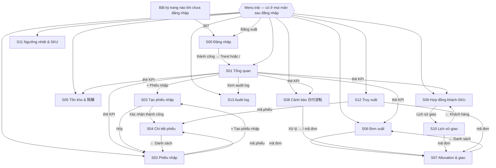

# 3. Danh sách màn hình, chuyển màn & phân quyền

## 3.1 Danh sách màn hình lõi

| ID tài liệu | URL | Mã v2 | Tên màn hình | Loại | Wireframe | Đặc tả |
|---|---|---|---|---|---|---|
| S00 | `/login` | SCR-00 | Đăng nhập | Form | [WF-00](../02-wireframes/wireframe-01-layout-login-dashboard.md#wf-00--đăng-nhập-scr-00) | [scr-00](../03-detail-design/scr-00-login.md) |
| S01 | `/` | SCR-01 | Tổng quan vận hành | Dashboard | [WF-01](../02-wireframes/wireframe-01-layout-login-dashboard.md#wf-01--tổng-quan-vận-hành-scr-01) | [scr-01](../03-detail-design/scr-01-dashboard.md) |
| S02 | `/inbound` | SCR-07 | Danh sách phiếu nhập | List | [WF-02](../02-wireframes/wireframe-02-inbound-inventory.md#wf-02--danh-sách-phiếu-nhập-scr-07) | [scr-07](../03-detail-design/scr-07-inbound-inspection.md) |
| S03 | `/inbound/new` | SCR-07 | Tạo & kiểm phiếu nhập | Form | [WF-03](../02-wireframes/wireframe-02-inbound-inventory.md#wf-03--tạo--kiểm-phiếu-nhập-scr-07) | [scr-07](../03-detail-design/scr-07-inbound-inspection.md) |
| S04 | `/inbound/[id]` | SCR-07 | Chi tiết phiếu nhập | Detail | [WF-04](../02-wireframes/wireframe-02-inbound-inventory.md#wf-04--chi-tiết-phiếu-nhập-scr-07) | [scr-07](../03-detail-design/scr-07-inbound-inspection.md) |
| S05 | `/inventory?view=all\|near\|quarantine` | SCR-08 + SCR-10 | Tồn kho đa tiêu chí · 隔離 / release / scrap | List + thao tác dòng | [WF-05](../02-wireframes/wireframe-02-inbound-inventory.md#wf-05--tồn-kho--隔離-scr-08--scr-10) | [scr-08-10](../03-detail-design/scr-08-10-inventory-and-quarantine.md) |
| S06 | `/outbound` | SCR-12 | Danh sách đơn xuất | List | [WF-06](../02-wireframes/wireframe-03-outbound-alerts.md#wf-06--danh-sách-đơn-xuất-scr-12) | [scr-12-13-15](../03-detail-design/scr-12-13-15-outbound-allocation-shipping.md) |
| S07 | `/outbound/[id]` | SCR-13 + SCR-15 | Allocation (chuỗi loại trừ) & kiểm trước xuất | Form | [WF-07](../02-wireframes/wireframe-03-outbound-alerts.md#wf-07--allocation--kiểm-trước-xuất-scr-13--scr-15) | [scr-12-13-15](../03-detail-design/scr-12-13-15-outbound-allocation-shipping.md) |
| S07a | (khung trong S07) | SCR-05 | Khung duyệt đề nghị ngoại lệ | Panel | [WF-07a](../02-wireframes/wireframe-03-outbound-alerts.md#wf-07a--khung-duyệt-đề-nghị-ngoại-lệ-scr-05) | [scr-05](../03-detail-design/scr-05-date-reversal-alerts-and-approval.md) |
| S08 | `/alerts` | SCR-05 + màn bổ sung | **Cảnh báo 日付逆転** · hàng chờ duyệt · nhật ký ngoại lệ | List | [WF-08](../02-wireframes/wireframe-03-outbound-alerts.md#wf-08--cảnh-báo-日付逆転-scr-05) | [scr-05](../03-detail-design/scr-05-date-reversal-alerts-and-approval.md) |
| S09 | `/customers` | SCR-03 | Khách hàng & hợp đồng khách-SKU | List + sửa dòng | [WF-09](../02-wireframes/wireframe-04-master-trace-audit.md#wf-09--hợp-đồng-khách-sku-scr-03) | [scr-03](../03-detail-design/scr-03-customer-agreements-and-history.md) |
| S10 | `/customers/[id]` | DR-HIST-01 | Lịch sử giao theo khách | List | [WF-10](../02-wireframes/wireframe-04-master-trace-audit.md#wf-10--lịch-sử-giao-theo-khách-dr-hist-01) | [scr-03](../03-detail-design/scr-03-customer-agreements-and-history.md) |
| S11 | `/settings` | SCR-32 + SCR-02 | Ngưỡng nhiệt & master SKU | Form dạng bảng | [WF-11](../02-wireframes/wireframe-04-master-trace-audit.md#wf-11--ngưỡng-nhiệt--master-sku-scr-32--scr-02) | [scr-32-02](../03-detail-design/scr-32-02-settings-thresholds-sku.md) |
| S12 | `/trace` | SCR-27 | Truy xuất xuôi / ngược | Tra cứu | [WF-12](../02-wireframes/wireframe-04-master-trace-audit.md#wf-12--truy-xuất-nguồn-gốc-scr-27) | [scr-27](../03-detail-design/scr-27-traceability.md) |
| S13 | `/audit` | SCR-34 | Audit log | List | [WF-13](../02-wireframes/wireframe-04-master-trace-audit.md#wf-13--audit-log-scr-34) | [scr-34](../03-detail-design/scr-34-audit-log.md) |

## 3.2 Sơ đồ chuyển màn

Quy tắc chung: `?next=` chỉ nhận đường dẫn nội bộ bắt đầu bằng `/` và không bắt đầu bằng `//`, để không bị dùng chuyển hướng ra trang ngoài. Đã đăng nhập mà mở `/login` thì về `/`.

## 3.3 Ma trận phân quyền (màn hình × vai trò)

Ký hiệu: **R** xem · **W** thao tác ghi · **A** duyệt · — không vào được.

| Màn / thao tác | warehouse | manager | qa (đích) | sales (đích) | admin (đích) | auditor (đích) |
|---|---|---|---|---|---|---|
| S01 Tổng quan | R | R | R | R | R | — |
| S02/S04 Xem phiếu nhập | R | R | R | — | R | R |
| S03 Tạo & kiểm phiếu nhập | W | W | — | — | — | — |
| S05 Xem tồn kho, cận hạn, 隔離 | R | R | R | R | R | R |
| S05 Release / scrap lô 隔離 | — | W | W | — | — | — |
| S06/S07 Xem đơn & kế hoạch lấy hàng | R | R | R | R | R | R |
| S07 Xác nhận giao (lô hợp lệ) | W | W | — | — | — | — |
| S07 Gửi đề nghị ngoại lệ 日付逆転 | W | W | — | — | — | — |
| S07a Duyệt / từ chối đề nghị | — | **A** (không phải người lập) | — | — | — | — |
| S08 Cảnh báo 日付逆転 | R | R | R | R | R | R |
| S09 Xem hợp đồng khách-SKU | R | R | R | R | R | R |
| S09 Chốt / đổi delivery window | — | W (đích: lập change request) | — | W (đích: lập change request) | — | — |
| S10 Lịch sử giao | R | R | R | R | R | R |
| S11 Xem ngưỡng nhiệt / SKU | R | R | R | R | R | R |
| S11 Sửa ngưỡng nhiệt, loại hạn, ngưỡng cận hạn | — | W (đích: lập change request) | W (đích: lập change request) | — | W (đích: lập change request) | — |
| S12 Truy xuất | R | R | R | R | R | R |
| S13 Audit log | R (đích: —) | R | R | — | R | R |

**[Prototype khác]** Prototype chỉ có cột `warehouse` và `manager`, đúng như bảng trên; mọi người có `profiles` đều đọc được mọi màn. Bản đích giới hạn đọc S13 và dữ liệu nhạy cảm theo vai trò. Thay đổi cấu hình ở S09/S11 trở thành change request: một người lập, người khác duyệt (DR-MST-01).

## 3.4 Thực thi phân quyền ở đâu

| Quyền | UI (ẩn/khóa nút) | BFF (`withAuth` + kiểm vai trò) | DB (RLS / hàm SQL) |
|---|---|---|---|
| Xem mọi màn | Menu đầy đủ | 401/403 | `provisioned_read`: `app_role() is not null` |
| Tạo phiếu nhập | Nút luôn hiện | — | `confirm_inbound_receipt` kiểm `NO_PROFILE` |
| Giao hàng / đề nghị ngoại lệ | Nút theo trạng thái đơn | `validateShipment` | `confirm_shipment` / `request_override` |
| Duyệt ngoại lệ | Chỉ hiện nút cho manager ≠ người lập | — | `decide_override`: `FORBIDDEN`, `SELF_APPROVAL` |
| Release / scrap | Chỉ hiện ở view 隔離 cho manager | — | `resolve_quarantine`: `FORBIDDEN` |
| Sửa cấu hình | Ô nhập bị `disabled` với warehouse | 403 nếu không phải manager | Policy `manager_update` + GRANT UPDATE theo cột |

UI chỉ giúp người dùng không bấm nhầm. Quyền thật được quyết ở BFF và DB, nên gọi API thẳng cũng không vượt được.
