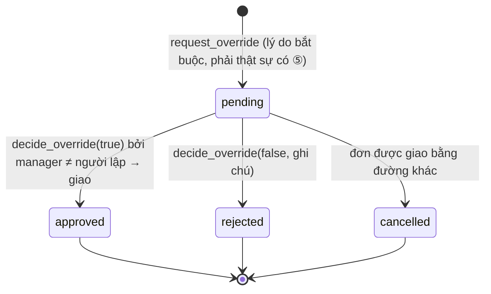

# SCR-05 — Cảnh báo 日付逆転 · hàng chờ duyệt ngoại lệ (maker-checker)

## 1. Thông tin chung

| Mục | Nội dung |
|---|---|
| Mục đích | (1) Báo **trước khi giao** những dòng đơn sắp phải giao cho khách một lô có hạn **sớm hơn** lô khách đó đã nhận (BR-DATE-01). (2) Hàng chờ duyệt đề nghị ngoại lệ. (3) Nhật ký bất biến các lượt bị chặn / được duyệt |
| URL | `/alerts` (S08) · khung duyệt nằm trong `/outbound/[id]` (S07a) |
| Vai trò | Xem: mọi vai trò · Duyệt / từ chối: `manager` **khác người lập** |
| API | `GET /api/alerts/date-reversal` · `POST /api/override-requests/[id]/decision` · `GET /api/me` |
| Hàm SQL | `decide_override(p_request_id, p_approve, p_note)` |
| Wireframe | [WF-08](../02-wireframes/wireframe-03-outbound-alerts.md#wf-08--cảnh-báo-日付逆転-scr-05) · [WF-07a](../02-wireframes/wireframe-03-outbound-alerts.md#wf-07a--khung-duyệt-đề-nghị-ngoại-lệ-scr-05) |
| Yêu cầu | BR-DATE-01, US-02, NFR-SEC-02, DR-HIST-01, BR-EXP-02, NFR-AUD-01 |

## 2. Quy tắc nghiệp vụ trung tâm

- **Mốc** = hạn lớn nhất (`max(expiry_date)`) trong `delivery_history` của **đúng cặp (khách, SKU)**.
- Lô vi phạm khi `lot.expiry_date < mốc`. Bằng mốc thì **không** vi phạm.
- **Không** so với hôm nay. **Không** mượn lịch sử khách khác: CUS-005 chưa nhận CHI-002 thì giao lô cũ được, dù CUS-003 đã nhận lô mới hơn.
- Ngoại lệ chỉ hợp lệ khi người duyệt (vai trò `manager`) **khác** người lập đề nghị.
- **[Chờ khách — Q2]** "最後に受け入れた配送" có thể hiểu là "lần giao gần nhất". Thiết kế chọn "hạn lớn nhất" vì chặt hơn. Hai cách chỉ khác nhau sau khi đã duyệt một ngoại lệ. Xem ADR-003.

## 3. S08 — Bảng phần tử

| No. | Tên | Kiểu | Nguồn dữ liệu / quy tắc |
|---|---|---|---|
| 1 | Tiêu đề + phụ đề | label | Cố định, nêu quy tắc |
| 2 | Hộp giải thích US-02 | alert xanh dương | Cố định |
| 3 | Đơn sắp giao bị CHẶN (đếm) | card + table | Dòng đơn `open` có ít nhất 1 lô mang mã ⑤ **và** `status='date_reversal'` (`severity='blocked'`) |
| 3a | Đơn / ngày giao | label | `order.code`, `ship_date` |
| 3b | Khách | label | `customer.code name` |
| 3c | SKU / SL | label + badge | `product.sku · qty`; "thiếu {shortfall} lô hợp lệ" đỏ; `‹Đang chờ duyệt›` tím nếu đơn có đề nghị pending |
| 3d | Mốc đã giao cho khách | label | `lastDelivery.lot_no`, `expiry_date` |
| 3e | Lô hạn sớm hơn trong kho | list | Mọi lô mang mã ⑤: `lot_no`, hạn, tồn |
| 3f | Xử lý → | link | `/outbound/{order.id}` |
| 4 | Đã có lô hợp lệ thay thế (đếm) | card + table | Như [3], nhưng `severity='avoided'` (có lô ⑤ trong kho, gợi ý FEFO vẫn đủ). Ẩn nếu 0 dòng |
| 5 | Hàng chờ duyệt (đếm pending) | card + table | 50 đề nghị mới nhất, mọi trạng thái |
| 5a | Thời điểm | datetime | `override_requests.created_at` |
| 5b | Đơn / khách | link + label | `order.code` → `/outbound/{id}`; `customer` |
| 5c | Người đề nghị | label | `requested_email` |
| 5d | Lý do | label | `reason` |
| 5e | Trạng thái | badge | `pending` "Chờ duyệt" tím · `approved` "Đã duyệt → giao" xanh · `rejected` "Từ chối" đỏ · `cancelled` "Huỷ (đơn đã giao)" xám |
| 5f | Người duyệt | label | `decided_email` + `decision_note` |
| 6 | Nhật ký ngoại lệ bất biến | table | 100 dòng `allocation_exceptions` mới nhất |
| 6a | Thời điểm | datetime | `created_at` |
| 6b | Quy tắc | badge | `BR-EXP-02` "消費期限" đỏ · `BR-DATE-01` "日付逆転" cam |
| 6c | Đơn | link | `order.code` |
| 6d | Khách | label | `customer` |
| 6e | SKU / lô | label | `product.sku`, `lot.lot_no` |
| 6f | Hạn lô vs mốc | label | BR-EXP-02: `lot_expiry ≤ ngày giao`; BR-DATE-01: `lot_expiry < reference_date` |
| 6g | Quyết định | badge | `blocked` "Bị chặn" đỏ · `overridden` "Đã duyệt ngoại lệ" tím |
| 6h | Người / lý do | label | `actor_email`; `reason` |

Rỗng: [3] "Không có đơn nào bị chặn." · [5] "Chưa có đề nghị nào." · [6] "Chưa có lượt chặn/duyệt nào."

## 4. S07a — Khung duyệt đề nghị

| No. | Tên | Kiểu | Bắt buộc | Nguồn / quy tắc |
|---|---|---|---|---|
| 1 | Người đề nghị · thời điểm · nhiệt khi xuất | label | — | `requested_email`, `created_at`, `ship_temp_c` |
| 2 | Lý do | label | — | `reason` |
| 3 | Danh sách phân bổ sẽ giao | list | — | Lấy từ `override_requests.allocations`, đối chiếu kế hoạch hiện tại: `sku · lô · hạn · SL`, đánh dấu "vi phạm 日付逆転" ở lô mang mã ⑤. Lô đã đổi/hết tồn → "(lô đã thay đổi)" |
| 4 | Ghi chú quyết định | text | ✓ khi **từ chối** | Trim |
| 5 | Duyệt & giao hàng | button | — | Hiện khi `me.role='manager'` **và** `me.email ≠ requested_email` |
| 6 | Từ chối | button đỏ | — | Như [5] |
| 7 | Thông báo không đủ quyền | label | — | Người lập: "Bạn là người lập đề nghị — không được tự duyệt; cần một quản lý khác." · người khác: "Chỉ quản lý (khác người đề nghị) được duyệt." |
| 8 | Hộp lỗi | alert | — | Thông báo lỗi API |

Người duyệt thấy **chính xác** các lô và số lượng sẽ giao. Khi duyệt, hệ thống giao đúng bộ phân bổ đã lưu, không lấy lại gợi ý mới.

## 5. Validation khi duyệt / từ chối (SQL `decide_override`)

| # | Quy tắc | Mã lỗi → HTTP / thông báo |
|---|---|---|
| V1 | Người gọi là `manager` | `FORBIDDEN` 403 |
| V2 | Đề nghị tồn tại và còn `pending` (khóa `FOR UPDATE`) | `REQUEST_NOT_PENDING` 409 "Đề nghị đã được xử lý." |
| V3 | Người duyệt ≠ `requested_by` | `SELF_APPROVAL` 403 "Người lập đề nghị không được tự duyệt (maker-checker) — cần quản lý khác." |
| V4 | Từ chối thì phải có ghi chú | `REASON_REQUIRED` 422 |
| V5 | Duyệt: chạy lại **toàn bộ** chuỗi giao hàng trên dữ liệu hiện tại (khóa, nhiệt, đủ SL, ①②③, tồn) | Mọi mã lỗi của `_validate_shipment`, ví dụ `INSUFFICIENT_STOCK` 409, `USE_BY_EXPIRED` 422 (lô đến hạn sau khi lập đề nghị). Lỗi thì đề nghị vẫn `pending` |
| V6 | id là UUID | 404 (BFF) |

## 6. Sự kiện

| Sự kiện | Xử lý | Thành công | Thất bại |
|---|---|---|---|
| Mở S08 | `GET /api/alerts/date-reversal` (pick-plan cho mọi đơn mở + 2 truy vấn) | 3 khối | Hộp lỗi + Thử lại |
| Bấm [5] | `POST /api/override-requests/{id}/decision {approve:true, note}` | Tải lại S07 → đơn `shipped`; đề nghị `approved`; nhật ký thêm dòng `overridden` | [8] |
| Bấm [6] | `… {approve:false, note}` | Tải lại → đơn `open`, khối [8] của S07 hiện lại cho người lập chọn lô khác | [8] |

## 7. Trạng thái đề nghị ngoại lệ

Ràng buộc: mỗi đơn tối đa **1** đề nghị `pending` (index duy nhất có điều kiện).

## 8. Nhật ký ngoại lệ bất biến (`allocation_exceptions`)

| Ai ghi | Khi nào | `decision` |
|---|---|---|
| BFF (bằng JWT người dùng, qua policy `log_blocked`) | Bấm giao có lô ⑤ mà không lý do; hoặc có lô ① | `blocked` |
| `_perform_shipment` | Mỗi lần giao: lô 消費期限 bị allocation loại | `blocked` (BR-EXP-02) |
| `_perform_shipment` khi duyệt | Giao lô ⑤ theo đề nghị đã duyệt | `overridden` |

Toàn vẹn: trigger `verify_blocked_exception` bỏ các trường client gửi và tự tính lại khách, SKU, hạn lô, mốc. Nếu không phải vi phạm thật → `NOT_A_VIOLATION`. Trigger `stamp_actor` ghi người thực hiện từ JWT. Không có quyền UPDATE/DELETE. Ràng buộc `allocation_exceptions_once` bảo đảm mỗi (quy tắc, đơn, lô, quyết định) chỉ ghi 1 lần.

## 9. Phân quyền

| Thao tác | warehouse | manager (người lập) | manager (người khác) |
|---|---|---|---|
| Xem S08 | ✓ | ✓ | ✓ |
| Lập đề nghị (ở S07) | ✓ | ✓ | ✓ |
| Duyệt / từ chối | — | — (`SELF_APPROVAL`) | ✓ |

## 10. [Prototype khác]

| Prototype | Hệ thống đích | Lý do |
|---|---|---|
| Không có thông báo khi có đề nghị mới | Gửi mail qua relay (IF-MAIL-01) cho nhóm quản lý; nhắc lại nếu quá X giờ chưa duyệt | Đơn bị kẹt thì xe không chạy |
| Đề nghị không có hạn | `expires_at` (ví dụ hết ca); quá hạn → `cancelled` | Phân bổ cũ không còn đúng sau nhiều giờ |
| 1 cấp duyệt | Cấu hình 1 hoặc 2 cấp **[Chờ khách — Q4]** | |
| `allocations` lưu dạng jsonb, người duyệt lưu dạng email | `override_request_items` (FK tới dòng đơn, lô) + `decided_by` FK tới `app_users` | Toàn vẹn tham chiếu (xem `05-database`) |
| Danh sách giới hạn 50/100 dòng, không lọc | Lọc theo ngày, khách, quy tắc; phân trang; xuất CSV | Audit |
| Pick-plan cho mọi đơn mở mỗi lần mở trang | Giữ (đơn mở ít); thêm cache ngắn nếu số đơn mở > vài trăm | Hiệu năng |
