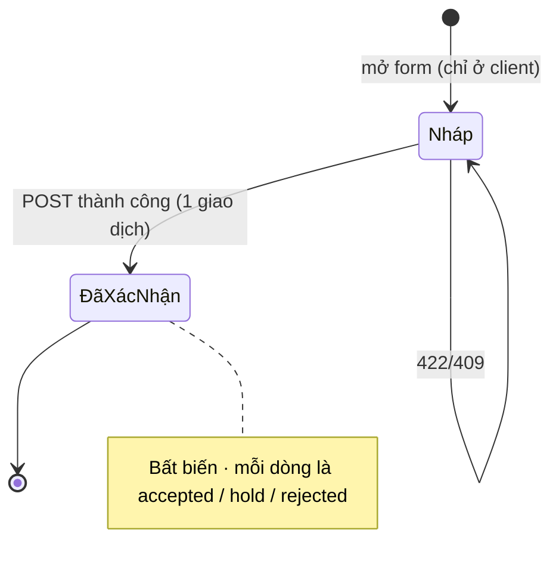

# SCR-07 — Nhập kho & kiểm hàng (danh sách · tạo & kiểm · chi tiết)

## 1. Thông tin chung

| Mục | Nội dung |
|---|---|
| Mục đích | Ghi nhận hàng đến, kiểm nhiệt/lô/hạn/mã truy xuất từng dòng, quyết định **受入 (Đạt) / 拒否 (Từ chối) / 保留 (vào 隔離)**. Dòng Đạt sinh lô tồn kho; dòng 保留 sinh lô ở trạng thái 隔離 |
| URL | `/inbound` (S02) · `/inbound/new` (S03) · `/inbound/[id]` (S04) |
| Vai trò | `warehouse`, `manager` |
| API | `GET /api/master` · `GET /api/inbound` · `POST /api/inbound` · `GET /api/inbound/[id]` |
| Hàm SQL | `confirm_inbound_receipt(p_supplier_id, p_arrival_date, p_note, p_lines)` |
| Wireframe | [WF-02](../02-wireframes/wireframe-02-inbound-inventory.md#wf-02--danh-sách-phiếu-nhập-scr-07) · [WF-03](../02-wireframes/wireframe-02-inbound-inventory.md#wf-03--tạo--kiểm-phiếu-nhập-scr-07) · [WF-04](../02-wireframes/wireframe-02-inbound-inventory.md#wf-04--chi-tiết-phiếu-nhập-scr-07) |
| Yêu cầu | FR-REC-02..05, BR-TEMP-01/02, BR-EXP-01/02, BR-TRACE-01/02, FE-06/07 |

## 2. S02 — Danh sách phiếu nhập

| No. | Tên | Kiểu | Nguồn dữ liệu | Ghi chú |
|---|---|---|---|---|
| 1 | Tiêu đề | label | — | |
| 2 | + Tạo phiếu nhập | button-link | — | → `/inbound/new` |
| 3a | Mã phiếu | link | `inbound_receipts.code` | → `/inbound/{id}` |
| 3b | Ngày nhận | date | `inbound_receipts.arrival_date` | |
| 3c | Nhà cung cấp | label | `suppliers.name` | |
| 3d | Dòng | number | `count(inbound_lines)` | |
| 3e | Số lượng | number | `sum(inbound_lines.qty)` | Gồm cả dòng từ chối (số hàng đến) |
| 3f | Kết quả kiểm | badge | `temp_ok=false` → "n dòng lệch nhiệt" đỏ, hết lệch → "Nhiệt độ đạt" xanh; `result='hold'` → "n 保留 → 隔離" cam; `result='rejected'` → "n từ chối" đỏ | |

Sắp xếp: `arrival_date desc, code desc`. Rỗng: "Chưa có phiếu nhập."

## 3. S03 — Tạo & kiểm phiếu nhập

### 3.1 Phần đầu phiếu

| No. | Tên | Kiểu | Bắt buộc | Định dạng / miền giá trị | Mặc định | Nguồn danh sách |
|---|---|---|---|---|---|---|
| 1 | Hủy | button-link | — | — | — | → `/inbound`, bỏ dữ liệu đang nhập |
| 2 | Hộp lỗi | alert | — | Thông báo + danh sách lỗi theo dòng (`details`) | ẩn | — |
| 3 | Nhà cung cấp | select | ✓ | `suppliers.id`; hiển thị `code · name` | "— Chọn —" | `/api/master → suppliers` |
| 4 | Ngày nhận | date | ✓ | Từ (hôm nay JST − 7 ngày) đến hôm nay JST | hôm nay JST | — |
| 5 | Ghi chú | text | — | Tự do | trống | — |

### 3.2 Mỗi dòng hàng (lặp, tối thiểu 1 dòng)

| No. | Tên | Kiểu | Bắt buộc | Định dạng / miền giá trị | Mặc định | Hành vi |
|---|---|---|---|---|---|---|
| — | Badge đầu dòng | badge | — | Dải nhiệt của SKU · loại hạn (`消費期限` đỏ / `賞味期限` xám) · "Truy xuất pháp định: 米/牛" (tím) nếu `trace_lane ≠ internal_lot` | — | Hiện khi đã chọn SKU |
| 6 | Xóa dòng | link | — | — | — | Ẩn khi chỉ còn 1 dòng |
| 7 | Sản phẩm (SKU) | select | ✓ | `products.id`; hiển thị `sku · name` | "— Chọn —" | Đổi SKU → xóa [13] vị trí và [16] mã truy xuất |
| 8 | Số lô | text | ✓ | Không rỗng sau trim; **duy nhất theo (SKU, số lô)** | trống | |
| 9 | Ngày sản xuất | date | ✓ | ISO date | trống | |
| 10 | Hạn dùng | date | ✓ | ≥ [9]. Nhãn kèm loại hạn của SKU | trống | |
| 11 | Số lượng | number | ✓ | Số nguyên > 0; nhãn kèm đơn vị SKU | trống | |
| 12 | Nhiệt độ đo khi nhận (°C) | number (step 0.1) | ✓ | Số; gợi ý dưới ô: "Ngưỡng Yuki: …" lấy từ `temperature_zones` của SKU | trống | Mỗi lần nhập: trong ngưỡng → viền xanh, kết quả = `accepted`; ngoài ngưỡng → viền đỏ, nền dòng đỏ nhạt, kết quả mặc định = `hold` nếu dải có vị trí -Q, nếu không thì `rejected`; xóa [13] |
| 13 | Vị trí lưu / Vị trí 隔離 (-Q) | select | ✓ nếu kết quả ≠ rejected | Chỉ liệt kê vị trí **cùng dải** với SKU, và `is_quarantine = (kết quả = hold)` | "— Chọn —" | Khóa khi chưa chọn SKU hoặc kết quả = `rejected`. Nhãn đổi thành "Vị trí 隔離 (-Q)" khi `hold` |
| 16 | Mã truy xuất | text | ✓ nếu lane `rice`/`beef` và kết quả ≠ rejected | `beef`: **đúng 10 chữ số** (`inputmode=numeric`); `rice`: chuỗi `産地・取引` không rỗng | trống | Chỉ hiện khi lane ≠ `internal_lot`. Nhãn: "Mã cá thể bò (個体識別番号, 10 số)" / "産地・取引 (gạo)" |
| 14 | Ghi chú xử lý lệch nhiệt | text | ✓ khi nhiệt ngoài ngưỡng | Không rỗng sau trim | trống | Chỉ hiện khi ngoài ngưỡng |
| 15 | Kết quả | select | ✓ khi nhiệt ngoài ngưỡng | `hold` "保留 — chuyển 隔離 chờ QA" (chỉ khi dải có -Q) · `rejected` "Từ chối — trả NCC" | theo [12] | Không có lựa chọn "Đạt" khi lệch nhiệt. Đổi kết quả → xóa [13] |

### 3.3 Chân form

| No. | Tên | Kiểu | Hành vi |
|---|---|---|---|
| 17 | + Thêm dòng | button | Thêm dòng trống |
| 18 | Tóm tắt | label | "n dòng · m không đạt (từ chối / 保留)" |
| 19 | Xác nhận kiểm & nhập kho | button submit | Gửi `POST /api/inbound`; khi gửi: "Đang lưu…", bị khóa |

### 3.4 Validation — 3 lớp

Lớp 1 là trình duyệt (`required`, `min`, gợi ý màu). Lớp 2 là BFF (`inspectInboundLines`): gom **mọi** lỗi rồi trả 422 một lần. Lớp 3 là SQL (`confirm_inbound_receipt`): kiểm lại, gặp lỗi đầu tiên thì dừng và rollback toàn phiếu.

| # | Quy tắc | BFF — thông báo (422) | SQL — mã lỗi |
|---|---|---|---|
| V1 | Có nhà cung cấp hợp lệ | "Chưa chọn nhà cung cấp." | `INVALID_SUPPLIER` |
| V2 | Ngày nhận hợp lệ, trong 7 ngày gần nhất, không ở tương lai (JST) | "Ngày nhận không hợp lệ." / "Ngày nhận chỉ được trong 7 ngày gần nhất và không ở tương lai." | `INVALID_ARRIVAL_DATE` |
| V3 | Có ≥ 1 dòng | "Phiếu nhập phải có ít nhất 1 dòng." | `NO_LINES` |
| V4 | Dòng có SKU | "Dòng n: chưa chọn sản phẩm." | `INVALID_PRODUCT` |
| V5 | Có số lô | "Dòng n (SKU): thiếu số lô." | **Không phủ**: SQL chỉ `trim()`, chuỗi rỗng vẫn lưu được (bản đích thêm CHECK) |
| V6 | NSX, hạn đúng định dạng; hạn ≥ NSX | "…thiếu ngày SX / hạn dùng." / "…hạn dùng trước ngày sản xuất." | CHECK `expiry_date >= mfg_date` → lỗi 23514 chưa ánh xạ, API trả **500** (chỉ xảy ra khi lách BFF) |
| V7 | Kết quả `accepted` + SKU `use_by` + hạn ≤ ngày nhận → không được nhập | "…消費期限 đã đến/quá ngay khi nhận — không được nhập kho." | `EXPIRED_ON_ARRIVAL` |
| V8 | Số lượng nguyên > 0 | "…số lượng phải là số nguyên > 0." | CHECK `qty > 0` → như V6, **500** |
| V9 | Có nhiệt độ | "…bắt buộc nhập nhiệt độ đo khi nhận." | `TEMP_REQUIRED` |
| V10 | Nhiệt ngoài ngưỡng → kết quả phải là `rejected`/`hold` **và** có ghi chú | "…nhiệt X°C ngoài ngưỡng … — phải chọn Từ chối hoặc 保留 (隔離) và ghi chú." | `TEMP_DEVIATION` |
| V11 | Gạo (`rice`), kết quả ≠ rejected → có `産地・取引` | "Gạo (米トレーサビリティ法): bắt buộc 産地・取引." | `RICE_TRACE_REQUIRED` |
| V12 | Bò (`beef`), kết quả ≠ rejected → đúng 10 chữ số; **9 chữ số không tự làm tròn** | 9 số: "Mã cá thể bò chỉ có 9 số → chuyển business-review, không tự làm tròn thành 10 số." · khác: "Mã cá thể bò (個体識別番号) phải đúng 10 chữ số." | `BEEF_ID_REVIEW` / `BEEF_ID_INVALID` |
| V13 | Kết quả ≠ rejected → vị trí cùng dải SKU; `hold` ⇔ vị trí -Q | "…chọn vị trí 隔離 (-Q) cùng dải nhiệt" / "…chọn vị trí lưu thường cùng dải nhiệt." | `INVALID_LOCATION` |
| V14 | (SKU, số lô) chưa tồn tại | — | UNIQUE `lots(product_id, lot_no)` → 409 "Số lô đã tồn tại cho sản phẩm này — kiểm tra lại số lô." |
| V15 | Kết quả thuộc {accepted, rejected, hold} | (BFF ép về `accepted` nếu lạ, rồi V10 vẫn chặn) | `INVALID_RESULT` |

Ngưỡng nhiệt đọc từ `temperature_zones` **tại thời điểm xác nhận**. Client không gửi `temp_ok`; SQL tự tính `temp_ok` và lưu lại.

### 3.5 Sự kiện

| Sự kiện | Xử lý | Thành công | Thất bại |
|---|---|---|---|
| Mở S03 | `GET /api/master` | Form với 1 dòng trống | Hộp lỗi "Không tải được danh mục" |
| Bấm [19] | `POST /api/inbound` body `{supplier_id, arrival_date, note, lines[{product_id, lot_no, mfg_date, expiry_date, qty, temp_c, temp_note, trace_code, location_id, result}]}` | 200 `{id}` → chuyển `/inbound/{id}` | 422/409: hiện [2], cuộn lên đầu, giữ nguyên dữ liệu |

### 3.6 Kết quả ghi (một giao dịch)

| Kết quả dòng | `inbound_lines` | `lots` |
|---|---|---|
| `accepted` | `location_id` = vị trí thường | Tạo lô `status='available'`, `qty_on_hand = qty` |
| `hold` | `location_id` = vị trí -Q | Tạo lô `status='quarantine'` tại vị trí -Q |
| `rejected` | `location_id = NULL` | Không tạo lô |

Mã phiếu: `IN-YYMMDD-nnnn` (YYMMDD theo ngày nhận, nnnn từ sequence `inbound_receipt_seq`). Ghi `audit_logs` action `inbound.confirm`.

## 4. S04 — Chi tiết phiếu nhập

| No. | Tên | Nguồn dữ liệu |
|---|---|---|
| 1 | Tiêu đề + phụ đề | `code`; `suppliers.name`; `arrival_date`; `created_at` |
| 2 | ← Danh sách | → `/inbound` |
| 3 | Ghi chú | `note` (ẩn nếu rỗng) |
| 4a | SKU | `products.sku`, `name` |
| 4b | Lô | `lot_no` |
| 4c | NSX → Hạn + badge loại hạn | `mfg_date`, `expiry_date`, `products.expiry_type` |
| 4d | SL | `qty` |
| 4e | Nhiệt đo (+ ghi chú lệch) | `temp_c` (xanh nếu `temp_ok`, đỏ nếu không), `temp_note` |
| 4f | Ngưỡng | `temperature_zones.name`, `min_c`, `max_c` (ngưỡng **hiện hành**; xem mục 6) |
| 4g | Vị trí | `locations.code` hoặc "—" |
| 4h | Truy xuất | `trace_code` + nhãn lane |
| 4i | Kết quả | `result` → "Đạt → nhập kho" xanh · "保留 → 隔離" cam · "Từ chối" đỏ |

Phiếu nhập **không sửa, không xóa** sau khi xác nhận. Sai thì xử lý bằng nghiệp vụ khác: 隔離 rồi scrap, hoặc điều chỉnh tồn (đích).

## 5. Trạng thái

## 6. Phân quyền

| Thao tác | warehouse | manager | Thực thi |
|---|---|---|---|
| Xem danh sách / chi tiết | ✓ | ✓ | RLS `provisioned_read` |
| Tạo & xác nhận phiếu | ✓ | ✓ | `confirm_inbound_receipt` (`NO_PROFILE` nếu thiếu profile) |

## 7. [Prototype khác]

| Prototype | Hệ thống đích | Lý do |
|---|---|---|
| Không có trạng thái nháp trên server; mất dữ liệu nếu đóng trang | `inbound_receipts.status` (`draft` → `confirmed`), lưu nháp | Hàng đến nhiều dòng, nhập trên tablet dễ bị gián đoạn |
| Mã bò 9 số bị **chặn nhận** (`BEEF_ID_REVIEW`) | Cho 保留 vào 隔離 với lô `status='review'` và lý do "BEEF_ID_REVIEW" **[Chờ khách — Q3]** | Hàng thật vẫn phải có chỗ để, không để ngoài kho lạnh |
| `trace_code` 1 chuỗi tự do (gạo: `産地/取引` gộp) | Bảng `lot_regulated_ids` có kiểu riêng (`RICE_ORIGIN`, `RICE_TRADE`, `BEEF_INDIVIDUAL`) | DR-TRACE-01: typed & searchable |
| Không ảnh chụp, không appointment, không tham chiếu NCC | `inbound_attachments` (ảnh + SHA-256), `supplier_ref` duy nhất theo NCC, `idempotency_key` | FR-REC-01/04: chống nhập trùng khi gửi lại |
| Chi tiết phiếu hiện ngưỡng **hiện hành** | Hiện ngưỡng **tại thời điểm nhận** (phiên bản ngưỡng theo ngày hiệu lực) | BR-TEMP-01; nếu ngưỡng đổi sau đó, màn hiện tại có thể gây hiểu nhầm |
| Ngày nhận chỉ trong 7 ngày | Giữ nguyên; nhập lùi quá 7 ngày phải qua maker-checker | Không cho lùi ngày để lách kiểm 消費期限 |
