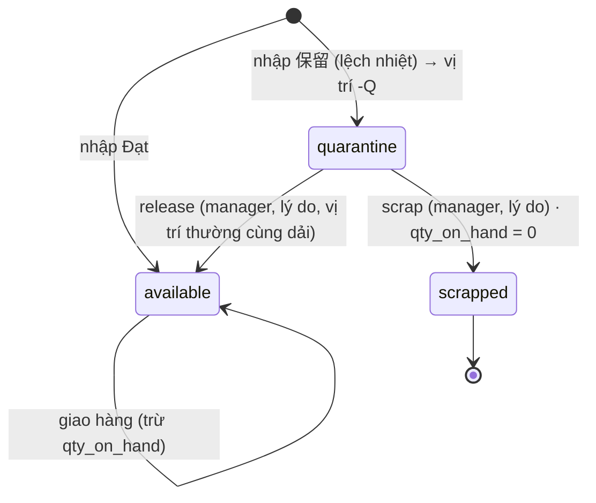

# SCR-08 + SCR-10 — Tồn kho đa tiêu chí · 隔離 / release / scrap

## 1. Thông tin chung

| Mục | Nội dung |
|---|---|
| Mục đích | Xem tồn theo SKU / lô / vị trí / dải nhiệt; cảnh báo cận hạn theo ngưỡng riêng từng SKU; quản lý quyết định lô 隔離 (release về kho hoặc scrap) |
| URL | `/inventory?view=all\|near\|quarantine&zone=0\|1\|2\|3` |
| Vai trò | Xem: mọi vai trò · Release/scrap: `manager` (đích: thêm `qa`) |
| API | `GET /api/inventory?view=&zone=` · `GET /api/master` (chỉ ở view 隔離) · `POST /api/lots/[id]/quarantine` · `GET /api/me` |
| Hàm SQL | `resolve_quarantine(p_lot_id, p_action, p_location_id, p_reason)` |
| Wireframe | [WF-05](../02-wireframes/wireframe-02-inbound-inventory.md#wf-05--tồn-kho--隔離-scr-08--scr-10) |
| Yêu cầu | FR-INV-05, FR-INV-06, FE-10, FE-12, BR-EXP-01 |

## 2. Bảng phần tử

| No. | Tên | Kiểu | Nguồn dữ liệu / quy tắc | Ghi chú |
|---|---|---|---|---|
| 1 | Tiêu đề | label | Theo `view`: "Tồn kho đa tiêu chí" / "Cảnh báo cận hạn" / "隔離 / release / scrap" | |
| 2 | Chế độ xem | radio-tab | `all` Toàn bộ tồn · `near` Cận hạn & quá hạn · `quarantine` 隔離 | Đổi tab → `router.replace` giữ `zone`. `view` lạ → `all` |
| 3 | Lọc dải nhiệt | radio-tab | `0` Tất cả · `1` 常温 · `2` 冷蔵 · `3` 冷凍 | Lọc theo `products.zone_id` (dải **của SKU**, không phải dải của vị trí) |
| 4 | Thông báo | alert | Kết quả release/scrap | Xanh khi thành công, đỏ khi lỗi |
| 5a | SKU | label | `products.sku`, `name` | |
| 5b | Lô / truy xuất | label | `lot_no`; `trace_code` (tím); nhãn lane nếu ≠ internal_lot | |
| 5c | Dải / vị trí | label + badge | `temperature_zones.name`; `locations.code`; `‹隔離›` nếu `status='quarantine'`; `‹sai dải›` đỏ nếu `locations.zone_id ≠ products.zone_id` | |
| 5d | Loại hạn | badge | `消費` đỏ / `賞味` xám | |
| 5e | Hạn dùng | date | `expiry_date` | |
| 5f | Còn | badge | `daysLeft = expiry − today(JST)`. `< 0`: "Quá hạn n ngày" đỏ · `≤ near_expiry_days`: "n ngày (ngưỡng m)" cam · còn lại: "n ngày" | |
| 5g | Tồn / nhập | number | `qty_on_hand / qty_received` + đơn vị | |
| 5h | NCC / Xử lý (QA) | label / nhóm thao tác | View `quarantine` + vai trò `manager` + lô `quarantine` → [6]–[9]; còn lại → `suppliers.name` | |
| 6 | Lý do (QA) | text | Bắt buộc (kiểm ở SQL) | |
| 7 | Vị trí release | select | Vị trí **thường** (`is_quarantine=false`) cùng dải với SKU, lấy từ `/api/master` | Chỉ cần khi release |
| 8 | Release | button | → `action='release'` | Khóa khi đang gửi |
| 9 | Scrap | button (đỏ) | → `action='scrap'` | Khóa khi đang gửi |

Màu nền dòng: tím nếu `quarantine`; đỏ nếu quá hạn; cam nếu cận hạn.
Dữ liệu: chỉ lô `qty_on_hand > 0`, sắp xếp `expiry_date` tăng dần.
Quy tắc lọc view: `near` → `expiry ≠ ok` (gồm cả quá hạn); `quarantine` → `status='quarantine'`.
Rỗng: "Không có lô phù hợp."

## 3. Validation (release / scrap)

| # | Quy tắc | Lớp | Mã lỗi → thông báo |
|---|---|---|---|
| V1 | Người gọi có profile | SQL | `NO_PROFILE` (403) |
| V2 | Vai trò là `manager` | SQL | `FORBIDDEN` (403) "Chỉ quản lý được thực hiện thao tác này." |
| V3 | Có lý do (sau trim) | SQL | `REASON_REQUIRED` (422) |
| V4 | Lô tồn tại và đang `quarantine` (khóa `FOR UPDATE`) | SQL | `LOT_NOT_QUARANTINED` (409) "Lô không còn ở trạng thái 隔離." |
| V5 | Release: vị trí tồn tại, **không** phải -Q, cùng dải với SKU | SQL | `INVALID_LOCATION` (422) |
| V6 | `action` ∈ {release, scrap} | SQL | `INVALID_ACTION` (422) |
| V7 | id lô là UUID | BFF | 404 |

Toàn bộ kiểm tra nằm trong hàm SQL. BFF chỉ chuyển tham số, nên gọi thẳng PostgREST cũng không lách được.

## 4. Sự kiện

| Sự kiện | Xử lý | Thành công | Thất bại |
|---|---|---|---|
| Đổi [2]/[3] | `GET /api/inventory?view=&zone=` | Bảng mới | Hộp lỗi + Thử lại |
| Bấm [8] | `POST /api/lots/{id}/quarantine {action:'release', location_id, reason}` | [4] "LOT…: đã release về kho — có ghi audit." · tải lại bảng (lô rời view 隔離) | [4] đỏ với thông báo lỗi |
| Bấm [9] | như trên, `action:'scrap'` | [4] "LOT…: đã hủy (scrap) — có ghi audit." · lô có `qty_on_hand=0` nên biến khỏi mọi view | như trên |

## 5. Trạng thái lô (FR-INV-05)

| Trạng thái | Vào allocation? | Ghi chú |
|---|---|---|
| `available` | Có (nếu qua chuỗi ①②④⑤) | |
| `quarantine` | **Không** (bước ③) | Ô "Lấy" bị khóa ở SCR-13 |
| `scrapped` | Không | `qty_on_hand = 0` |

## 6. Phân quyền

| Thao tác | warehouse | manager | qa (đích) |
|---|---|---|---|
| Xem 3 view | ✓ | ✓ | ✓ |
| Release / scrap | — (không hiện nhóm thao tác) | ✓ | ✓ |

## 7. [Prototype khác]

| Prototype | Hệ thống đích | Lý do |
|---|---|---|
| Lô chỉ vào 隔離 lúc nhập | Thêm chiều `available → quarantine` (QA phát hiện sau, logger báo lệch nhiệt) có lý do + liên kết deviation case | Luồng QA disposition của RFP, F07 |
| Đổi trạng thái/vị trí bằng `update lots` trực tiếp, không có sổ di chuyển | Mọi thay đổi số lượng/vị trí ghi `inventory_movements` (receive, quarantine, release, scrap, ship, adjust) | FE-09: truy được tồn tại một thời điểm |
| Không có trạng thái `review` | Thêm `review` cho lô chờ business-review (mã bò 9 số) | Q3 |
| Lọc và tính `daysLeft` ở BFF sau khi kéo mọi lô (giới hạn 1.000 dòng của API) | Lọc/phân trang trong SQL; thêm tìm theo SKU, số lô, NCC, vị trí | Quy mô thật |
| Chỉ `manager` release/scrap | Vai trò `qa` | Tách quyền QA |
