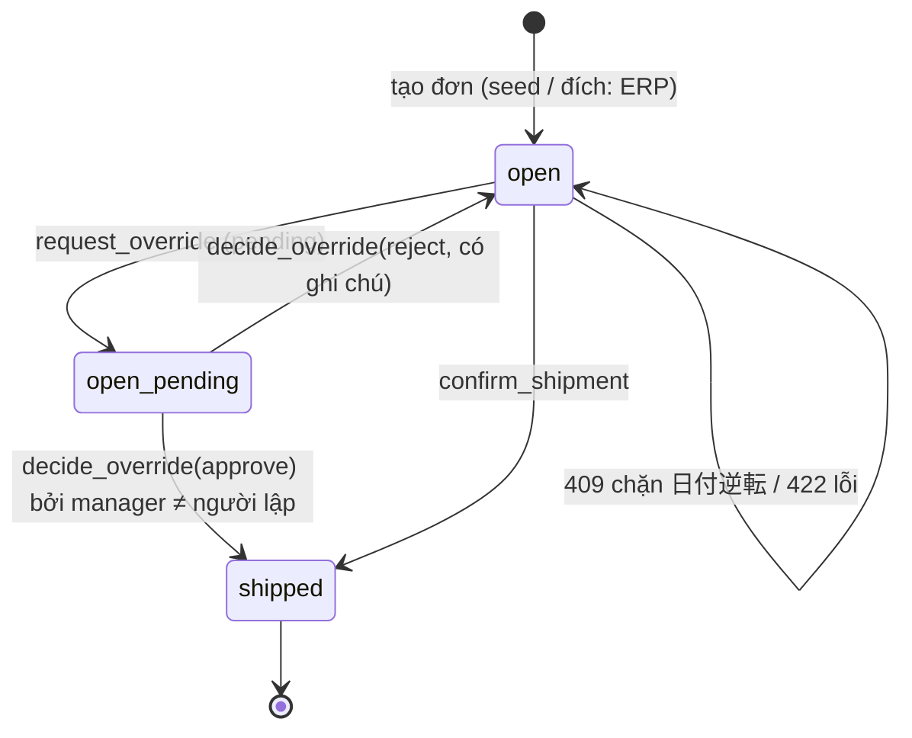

# SCR-12 / SCR-13 / SCR-15 — Đơn xuất · Allocation (chuỗi loại trừ) · Kiểm trước xuất & giao

## 1. Thông tin chung

| Mục | Nội dung |
|---|---|
| Mục đích | Với mỗi dòng đơn: chỉ ra lô nào được giao, lô nào bị loại và vì sao (chuỗi FR-OUT-02), gợi ý FEFO, cho người dùng chọn/sửa, ghi nhiệt khi xuất, xác nhận giao. Lô vi phạm 日付逆転 không giao thẳng được, chỉ đi qua đề nghị ngoại lệ |
| URL | `/outbound` (S06) · `/outbound/[id]` (S07) |
| Vai trò | Xem: mọi vai trò · Giao / đề nghị ngoại lệ: `warehouse`, `manager` · Duyệt: xem [scr-05](scr-05-date-reversal-alerts-and-approval.md) |
| API | `GET /api/outbound` · `GET /api/outbound/[id]` · `POST /api/outbound/[id]/ship` · `GET /api/me` |
| Hàm SQL | `confirm_shipment`, `request_override`; nội bộ `_validate_shipment`, `_perform_shipment`; đọc `last_deliveries` |
| Wireframe | [WF-06](../02-wireframes/wireframe-03-outbound-alerts.md#wf-06--danh-sách-đơn-xuất-scr-12) · [WF-07](../02-wireframes/wireframe-03-outbound-alerts.md#wf-07--allocation--kiểm-trước-xuất-scr-13--scr-15) |
| Yêu cầu | FR-OUT-02, FR-OUT-05 (một phần), BR-EXP-02, BR-TEMP-02, BR-FEFO-01, BR-DELWIN-01, BR-DATE-01, US-01, US-02, US-05, NFR-SEC-02 |

## 2. S06 — Danh sách đơn xuất

| No. | Tên | Kiểu | Nguồn / quy tắc |
|---|---|---|---|
| 1 | Tiêu đề | label | — |
| 2 | Tab | radio-tab | `open` Chờ xuất (mặc định) · `shipped` Đã giao; lọc ở client |
| 3a | Mã đơn | link | `outbound_orders.code` → `/outbound/{id}` |
| 3b | Ngày giao | date | `ship_date` |
| 3c | Khách hàng | label | `customers.code` + `name` |
| 3d | Dòng / SL | number | số dòng / tổng `qty` |
| 3e | Kiểm tra trước khi giao | badge | Chỉ tính cho đơn `open`: `‹n dòng chặn 日付逆転›` đỏ (`reversalLines`) · `‹Chờ duyệt ngoại lệ›` tím · `‹n dòng thiếu lô hợp lệ›` cam (`shortLines`) · `‹n hợp đồng chưa chốt window›` cam (`reviewLines`, gồm cả dòng không có hợp đồng) · `‹n lô bị loại›` xám · `‹Giao được›` xanh khi không có dòng chặn/thiếu và không có đề nghị chờ. Đơn `shipped`: `‹Đã giao›` |

Sắp xếp: `ship_date`, `code`. Rỗng: "Không có đơn."

## 3. S07 — Allocation & kiểm trước xuất

### 3.1 Phần đầu và thông báo

| No. | Tên | Kiểu | Nguồn / quy tắc |
|---|---|---|---|
| 1 | Tiêu đề | label | "Đơn xuất {code}" · `customers.code name` · "giao {ship_date}" |
| 2 | ← Danh sách | link | `/outbound` |
| 3 | Kết quả thao tác | alert | Thành công: "Đã xác nhận giao. Lịch sử giao của khách đã cập nhật, tồn kho đã trừ." hoặc "Đã gửi đề nghị ngoại lệ — chờ một quản lý khác duyệt."; kèm danh sách `warnings[]` (cam) |
| 4 | Khung duyệt đề nghị | panel | Hiện khi đơn `open` và có `pendingOverride` — xem scr-05 |

### 3.2 Thẻ dòng đơn (lặp theo `outbound_lines`)

| No. | Tên | Kiểu | Nguồn / quy tắc |
|---|---|---|---|
| 5a | SKU · tên | label | `products.sku`, `name` |
| 5b | Badge thuộc tính | badge | Dải nhiệt · loại hạn · hợp đồng `AGR-xxx · delivery_term · window` (window NULL → "chưa chốt → business-review" cam; không có hợp đồng → "Không có hợp đồng khách-SKU" đỏ) |
| 5c | Trạng thái dòng | badge | `ok` "Đủ lô hợp lệ" xanh · `date_reversal` "Chặn 日付逆転" đỏ · `insufficient` "Thiếu lô hợp lệ" cam. Ẩn khi chỉ đọc |
| 5d | Mốc 日付逆転 | label | `last_deliveries(customer, sku)`: "đã nhận lô {lot_no} hạn {expiry} ({delivered_at}) → chỉ được giao lô hạn ≥ ngày này." Không có → "khách chưa từng nhận SKU này → không có ràng buộc (không mượn lịch sử khách khác)." |
| 5e | Cần giao | number | `outbound_lines.qty` + đơn vị |
| 5f | Đã chọn | number | Tổng ô [7] của dòng; xanh khi bằng [5e], cam khi khác. Ẩn khi chỉ đọc |
| 5g | Cảnh báo 日付逆転 | alert đỏ | Hiện khi `status='date_reversal'`: "không đủ lô hợp lệ — thiếu {shortfall}. Còn {reversalOnlyQty} đơn vị chỉ vướng 日付逆転…" |
| 6a | Lô | label | `lots.lot_no`, xếp **FEFO → FIFO** (`expiry_date`, rồi `received_at`) |
| 6b | Hạn dùng | date | `expiry_date` |
| 6c | Tồn | number | `qty_on_hand` |
| 6d | Vị trí | label | `locations.code` |
| 6e | Chuỗi loại trừ | badge (nhiều) | `‹Đề xuất FEFO›` nếu nằm trong gợi ý; mọi mã vi phạm theo thứ tự ①→⑤ (mục 4); lô sạch: chữ xám `納品期限 {deadline}` (trừ `LABEL_DATE_ONLY`) |
| 7 | Lấy | number | `min=0`, `max=qty_on_hand`. **Khóa** khi lô vi phạm ①/②/③. Giá trị đầu = số lượng gợi ý FEFO; tải lại kế hoạch thì về gợi ý |

### 3.3 Khối kiểm trước xuất & xác nhận (SCR-15)

| No. | Tên | Kiểu | Bắt buộc | Quy tắc |
|---|---|---|---|---|
| 8 | Khung | card | — | Ẩn khi đơn có đề nghị pending |
| 9 | Nhiệt độ hàng khi xuất (°C) | number step 0.1 | ✓ | Gợi ý: "Đo ở dải lạnh nhất của đơn: {range}". Dải lạnh nhất = dải có `max_c` nhỏ nhất trong các SKU của đơn (NULL coi là +∞) |
| 10 | Lý do đề nghị ngoại lệ 日付逆転 | text | ✓ để gửi đề nghị | Chỉ hiện khi có ít nhất 1 lô mang mã ⑤ được nhập số lượng > 0 |
| 11 | Hộp lỗi | alert | — | Thông báo + `details.errors[]` |
| 12 | Nút xác nhận | button | — | Nhãn và màu theo trạng thái: xem WF-07. Khi gửi: "Đang kiểm tra…" |

## 4. Chuỗi loại trừ FR-OUT-02 (áp cho từng lô)

`refDate = max(ship_date, hôm nay JST)`: đơn giao trễ thì xét theo ngày thực giao.

| Bước | Mã | Điều kiện vi phạm | Gợi ý tự động | Chọn tay | Chốt SQL |
|---|---|---|---|---|---|
| ① | `use_by_expired` | SKU `use_by` và `expiry_date ≤ refDate` | Loại | **Chặn** (ô khóa) · ghi `allocation_exceptions` BR-EXP-02 | `USE_BY_EXPIRED` |
| ② | `zone_mismatch` | `locations.zone_id ≠ products.zone_id` (hoặc lô không có vị trí) | Loại | **Chặn** | `ZONE_MISMATCH` |
| ③ | `quarantine` | `lots.status ≠ 'available'` | Loại | **Chặn** | `LOT_QUARANTINED` |
| ④ | `window_violation` | `refDate > 納品期限` theo hợp đồng (mục 4.1) | Loại | **Chỉ cảnh báo** (warnings) — tập quán thương mại, không phải luật | Không kiểm (cố ý) |
| ⑤ | `date_reversal` | Có mốc và `expiry_date < mốc` (mốc = hạn lớn nhất đã giao cho **cặp khách × SKU**) | Loại | **Chặn**, trừ khi đi đường ngoại lệ maker-checker | `DATE_REVERSAL` |
| — | FEFO | Lô còn lại: hạn sớm trước; cùng hạn → nhập trước (FIFO) | Lấy lần lượt tới đủ số lượng | — | — |

Một lô có thể vi phạm nhiều bước, tất cả đều hiện. Gợi ý chỉ ghi nhận **bước đầu tiên** vi phạm (`excluded[].code`).

### 4.1 納品期限 (delivery window)

| `window_rule` | 納品期限 | Ghi chú |
|---|---|---|
| `ONE_THIRD` | `mfg_date + ⌊(expiry − mfg) × 1/3⌋` ngày | |
| `ONE_HALF` | `mfg_date + ⌊(expiry − mfg) × 1/2⌋` ngày | |
| `LABEL_DATE_ONLY` | `expiry_date` | Chỉ so hạn trên nhãn |
| `NULL` | Không tính → trạng thái `review` | **Không bao giờ tự áp mặc định**; cảnh báo business-review |

### 4.2 Trạng thái dòng

| Trạng thái | Điều kiện |
|---|---|
| `ok` | Gợi ý FEFO đủ số lượng (`shortfall = 0`) |
| `date_reversal` | Thiếu, và còn lô **chỉ** vướng ⑤ (`reversalOnlyQty > 0`) |
| `insufficient` | Thiếu, và không có lô nào chỉ vướng ⑤ |

## 5. Validation khi bấm [12]

### 5.1 Lớp BFF (`validateShipment` + kiểm nhiệt), gom lỗi, trả 422

| # | Quy tắc | Thông báo |
|---|---|---|
| V1 | Đơn còn `open` | "Đơn đã được giao, không thể xác nhận lại." |
| V2 | Đơn không có đề nghị pending | "Đơn đang có đề nghị ngoại lệ chờ quản lý duyệt." |
| V3 | Mỗi dòng: tổng chọn = số lượng đơn | "{SKU}: đã chọn x/y — phải phân bổ đủ số lượng đơn." |
| V4 | Mỗi dòng có hợp đồng khách-SKU | "{SKU}: khách chưa có hợp đồng khách-SKU." |
| V5 | Lô thuộc danh sách lô của dòng (còn tồn) | "{SKU}: lô không hợp lệ hoặc hết tồn." |
| V6 | 0 < SL ≤ tồn; tổng theo lô ≤ tồn (cùng lô nhập 2 lần) | "{lot}: số lượng x vượt tồn y." / "{lot}: tổng x vượt tồn y." |
| V7 | ① | "{lot}: 消費期限 … đã đến/quá — HARD STOP, không có ngoại lệ." + ghi lượt chặn BR-EXP-02 |
| V8 | ② | "{lot}: đang nằm sai dải nhiệt ({vị trí}) — không được xuất." |
| V9 | ③ | "{lot}: đang 隔離 — chờ QA release." |
| V10 | Dòng phân bổ thuộc đơn | "Có dòng phân bổ không thuộc đơn này." |
| V11 | Có nhiệt độ | "Bắt buộc ghi nhiệt độ hàng khi xuất." |
| V12 | Nhiệt trong dải lạnh nhất | "Nhiệt độ khi xuất X°C ngoài ngưỡng … — xử lý chuỗi lạnh trước khi giao." |

Cảnh báo (không chặn, trả trong `warnings[]` khi thành công): ④ "{lot}: quá 納品期限 {deadline} ({window}, {AGR}) — tập quán thương mại, không phải hạn thực." · hợp đồng chưa chốt "{SKU}: {AGR} chưa chốt delivery window → business-review (không áp mặc định)."

### 5.2 Rẽ nhánh ⑤ 日付逆転

| Có lô ⑤ được chọn? | Có lý do [10]? | Kết quả |
|---|---|---|
| Không | — | `rpc confirm_shipment` → giao |
| Có | Không | Ghi `allocation_exceptions(rule='BR-DATE-01', decision='blocked')` (trigger tự tính lại, trùng thì bỏ qua) → **409** "CHẶN: vi phạm 日付逆転禁止. Chọn lô khác, hoặc nhập lý do để gửi đề nghị ngoại lệ cho quản lý duyệt." `details.reversals[]` |
| Có | Có | `rpc request_override` → 200 `{requested:true, requestId}`; đơn đã có đề nghị pending → 409 "Đơn này đã có đề nghị ngoại lệ đang chờ duyệt." |

### 5.3 Lớp SQL (`_validate_shipment`, chốt cuối)

Thứ tự: nhiệt xuất (`SHIP_TEMP_OUT_OF_RANGE`) → đủ số lượng từng dòng (`ALLOCATION_MISMATCH`) → chụp mốc 日付逆転 → với từng phân bổ (xếp theo lot_id): `INVALID_QTY`, `LINE_NOT_IN_ORDER`, `LOT_PRODUCT_MISMATCH`, `INSUFFICIENT_STOCK`, `USE_BY_EXPIRED`, `ZONE_MISMATCH`, `LOT_QUARANTINED`, gom ⑤ → tổng theo lô ≤ tồn. Khi giao thường mà có ⑤ → `DATE_REVERSAL`. Trước khi validate, `_perform_shipment` khóa đơn (`ORDER_NOT_FOUND`, `ORDER_NOT_OPEN`) và advisory lock theo khách × SKU.

## 6. Kết quả ghi khi giao (một giao dịch)

1. Ghi BR-EXP-02 cho **mọi** lô 消費期限 còn tồn của các SKU trong đơn mà allocation phải loại (mỗi lô 1 lần).
2. Nếu đi đường ngoại lệ đã duyệt: ghi BR-DATE-01 `overridden` kèm lý do + người duyệt.
3. Trừ `lots.qty_on_hand` theo từng phân bổ.
4. Ghi `delivery_history` (khách, SKU, lô, đơn, SL, hạn lô, thời điểm). Bản ghi này thành mốc 日付逆転 mới.
5. `outbound_orders`: `status='shipped'`, `ship_temp_c`, `shipped_at`, `shipped_by`.
6. Đề nghị pending khác của đơn → `cancelled` ("Đơn đã được giao").
7. `audit_logs` `outbound.ship` (phân bổ, nhiệt, số ngoại lệ, lý do, người duyệt).

## 7. Trạng thái đơn

`open_pending` không phải giá trị cột. Đây là trạng thái suy ra: `status='open'` và có `override_requests.status='pending'`. Khi ở trạng thái này, S07 chỉ đọc và ẩn khối [8].

## 8. Phân quyền

| Thao tác | warehouse | manager | Thực thi |
|---|---|---|---|
| Xem danh sách, kế hoạch lấy hàng | ✓ | ✓ | RLS đọc |
| Xác nhận giao (lô hợp lệ) | ✓ | ✓ | `confirm_shipment` kiểm `app_role()` |
| Gửi đề nghị ngoại lệ | ✓ | ✓ | `request_override` kiểm profile, lý do, đơn `open`, thật sự có ⑤ (`NO_REVERSAL`) |
| Ghi lượt chặn | ✓ | ✓ | Policy `log_blocked` + trigger `verify_blocked_exception` |

## 9. [Prototype khác]

| Prototype | Hệ thống đích | Lý do |
|---|---|---|
| Đơn có sẵn từ seed | Nhận từ ERP (IF-ERP-01) qua `erp_import_batches`; thêm trạng thái `cancelled` | FR-OUT-01 |
| Phân bổ không lưu riêng; chỉ thể hiện qua `delivery_history` và `override_requests.allocations` (jsonb) | Bảng `outbound_allocations` (dòng đơn × lô × SL × trạng thái `planned/shipped`) và `override_request_items` | Truy vết từng dòng; đề nghị ngoại lệ có khóa ngoại thật thay vì jsonb |
| 1 nhiệt độ cho cả đơn (dải lạnh nhất) | `shipment_temperature_checks` theo khoang/dải + seal + giờ; lệch → deviation case | FR-OUT-05 |
| ④ không kiểm ở SQL | Giữ nguyên (cố ý: ④ chỉ cảnh báo) nhưng **ghi** cảnh báo ④ đã bỏ qua vào `outbound_allocations.warnings` | Bằng chứng khi khách khiếu nại |
| 日付逆転 theo khách | Thêm `customer_sites`; phạm vi so sánh cấu hình được (khách hoặc điểm giao) **[Chờ khách — Q1]** | |
| Kế hoạch lấy hàng tính lại mỗi lần mở trang, đọc mọi lô còn tồn của SKU | Giữ cách tính; giới hạn theo SKU của các đơn đang mở và dùng index `lots_product_expiry_idx` | Hiệu năng |
