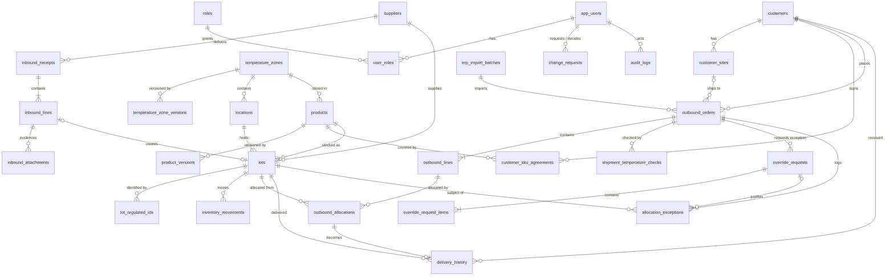
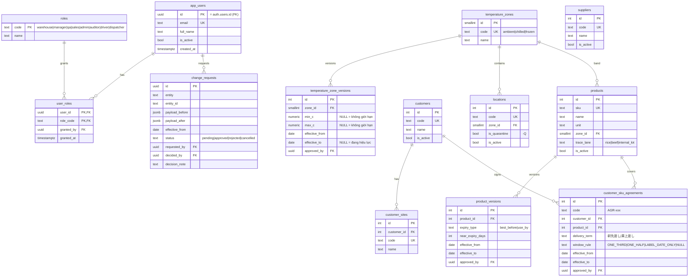
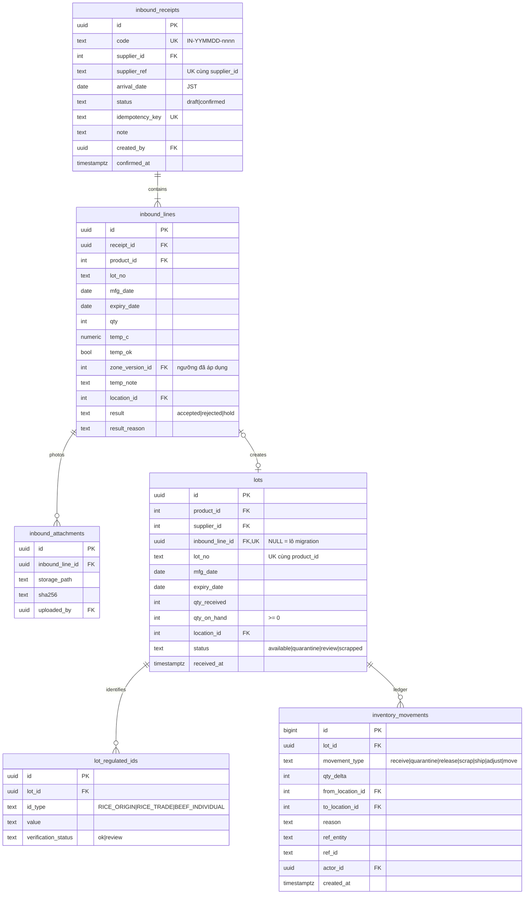
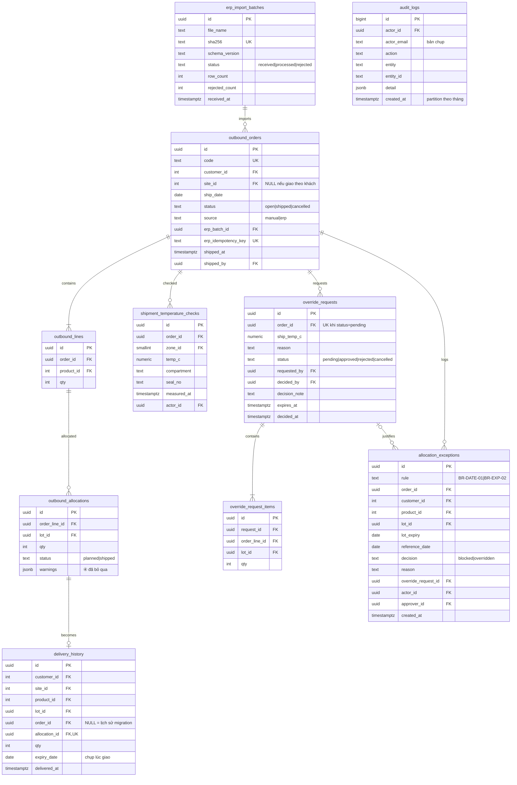

# Sơ đồ cơ sở dữ liệu (thiết kế đích) — thực thể · quan hệ · PK/FK

> Thiết kế cho bản build, phạm vi các module lõi của LAB-4, có giữ chỗ cho ERP. Các điểm khác với bảng prototype đang chạy thật trên Supabase được đối chiếu ở [02-prototype-vs-design-comparison.md](02-prototype-vs-design-comparison.md).
> Ký hiệu ★ = bảng hoặc cột **không có** ở prototype.

## 1. Nguyên tắc thiết kế

| # | Nguyên tắc | Lý do |
|---|---|---|
| P1 | Master dùng khóa số (`int`/`smallint` identity), giao dịch dùng `uuid` | Master ít dòng, hay join, mã đọc được; giao dịch sinh ở nhiều nơi, không đoán được id |
| P2 | Mọi bảng có mã nghiệp vụ duy nhất (`code`, `sku`, `lot_no` theo SKU) ngoài khóa kỹ thuật | Người dùng và tích hợp ERP tra theo mã |
| P3 | Cấu hình làm đổi kết quả hard stop có **phiên bản theo ngày hiệu lực** | ADR-004, DR-MST-01, BR-TEMP-01 |
| P4 | Bảng sự kiện **bất biến**: `delivery_history`, `allocation_exceptions`, `audit_logs`, `inventory_movements` | DR-HIST-01, NFR-AUD-01; chặn UPDATE/DELETE bằng quyền **và** trigger |
| P5 | Người thực hiện luôn là FK tới `app_users`. Chỉ `audit_logs` giữ thêm bản chụp email | Toàn vẹn tham chiếu; audit phải đọc được kể cả khi tài khoản đổi email |
| P6 | Miền giá trị nhỏ, cố định dùng `CHECK`; danh mục người dùng sửa được thì dùng bảng | Đơn giản (KISS); vai trò là bảng vì cần gán nhiều-nhiều |
| P7 | Mọi FK có index ở phía con | Postgres không tự tạo index cho FK |
| P8 | Thời điểm lưu `timestamptz`; ngày nghiệp vụ lưu `date` theo JST | NFR-LOC-01; tránh lệch ngày 00:00–09:00 JST |

## 2. Tổng quan quan hệ

## 3. Sơ đồ chi tiết theo nhóm

### 3.1 Người dùng, master, cấu hình

### 3.2 Nhập kho, tồn kho, truy xuất

### 3.3 Xuất kho, ngoại lệ, lịch sử, audit

## 4. Định nghĩa bảng

Cột chung không nhắc lại: `created_at timestamptz not null default now()` ở mọi bảng (trừ khi ghi khác); `updated_at` ở bảng master.

### 4.1 Người dùng & phân quyền

| Bảng | Cột chính | PK | FK | UK / CHECK / ghi chú |
|---|---|---|---|---|
| `app_users` ★ (thay `profiles`) | `id uuid`, `email text`, `full_name text`, `is_active bool` | `id` | `id → auth.users(id) on delete restrict` | UK `email`. Vô hiệu hóa bằng `is_active`, không xóa (giữ tham chiếu audit) |
| `roles` ★ | `code text`, `name text` | `code` | — | 8 dòng cố định |
| `user_roles` ★ | `user_id uuid`, `role_code text`, `granted_by uuid`, `granted_at` | (`user_id`, `role_code`) | `user_id → app_users`, `role_code → roles`, `granted_by → app_users` | Hàm `has_role(code)` thay `app_role()` |

### 4.2 Master & cấu hình

| Bảng | Cột chính | PK | FK | UK / CHECK / ghi chú |
|---|---|---|---|---|
| `temperature_zones` | `id smallint`, `code`, `name` | `id` | — | UK `code`; CHECK `code in (ambient, chilled, frozen)` |
| `temperature_zone_versions` ★ | `zone_id`, `min_c numeric(5,1)`, `max_c numeric(5,1)`, `effective_from date`, `effective_to date`, `approved_by` | `id` | `zone_id → temperature_zones`, `approved_by → app_users` | CHECK `min_c is not null or max_c is not null`, `min_c <= max_c`; EXCLUDE chồng `daterange(effective_from, effective_to)` theo `zone_id` |
| `locations` | `code`, `zone_id`, `is_quarantine`, `is_active` ★ | `id` | `zone_id → temperature_zones` | UK `code` |
| `suppliers` | `code`, `name`, `is_active` ★ | `id` | — | UK `code` |
| `customers` | `code`, `name`, `is_active` ★ | `id` | — | UK `code` |
| `customer_sites` ★ | `customer_id`, `code`, `name` | `id` | `customer_id → customers` | UK `code`. **[Chờ khách — Q1]** |
| `products` | `sku`, `name`, `unit`, `zone_id`, `trace_lane`, `is_active` ★ | `id` | `zone_id → temperature_zones` | UK `sku`; CHECK `trace_lane`. `expiry_type`, `near_expiry_days` chuyển sang `product_versions` |
| `product_versions` ★ | `product_id`, `expiry_type`, `near_expiry_days`, `effective_from`, `effective_to`, `approved_by` | `id` | `product_id → products`, `approved_by → app_users` | CHECK `expiry_type in (best_before, use_by)`, `near_expiry_days between 0 and 365`; EXCLUDE chồng khoảng |
| `customer_sku_agreements` | `code`, `customer_id`, `product_id`, `delivery_term`, `window_rule`, `effective_from`, `effective_to` ★, `approved_by` ★ | `id` | `customer_id → customers`, `product_id → products`, `approved_by → app_users` | UK (`customer_id`, `product_id`, `effective_from`); UK (`code`, `effective_from`); EXCLUDE chồng khoảng theo (`customer_id`, `product_id`); CHECK `window_rule` (NULL = chưa chốt), `delivery_term` |
| `change_requests` ★ | `entity`, `entity_id`, `payload_before jsonb`, `payload_after jsonb`, `effective_from`, `status`, `requested_by`, `decided_by`, `decision_note`, `decided_at` | `id uuid` | `requested_by`, `decided_by → app_users` | CHECK `decided_by <> requested_by`; index một phần `(entity, entity_id) where status='pending'` UK |

### 4.3 Nhập kho & tồn kho

| Bảng | Cột chính | PK | FK | UK / CHECK / ghi chú |
|---|---|---|---|---|
| `inbound_receipts` | `code`, `supplier_id`, `supplier_ref` ★, `arrival_date`, `status` ★, `idempotency_key` ★, `note`, `created_by`, `confirmed_at` ★ | `id uuid` | `supplier_id → suppliers`, `created_by → app_users` | UK `code`; UK (`supplier_id`, `supplier_ref`); UK `idempotency_key`; **không** đặt default cho `arrival_date` |
| `inbound_lines` | `receipt_id`, `product_id`, `lot_no`, `mfg_date`, `expiry_date`, `qty`, `temp_c`, `temp_ok`, `zone_version_id` ★, `temp_note`, `location_id`, `result`, `result_reason` ★ | `id uuid` | `receipt_id → inbound_receipts on delete cascade` (chỉ khi `draft`), `product_id`, `location_id`, `zone_version_id → temperature_zone_versions` | CHECK `expiry_date >= mfg_date`, `qty > 0`, `result`; CHECK `result='rejected' or location_id is not null`. Index `receipt_id` |
| `inbound_attachments` ★ | `inbound_line_id`, `storage_path`, `sha256`, `uploaded_by` | `id uuid` | `inbound_line_id → inbound_lines`, `uploaded_by → app_users` | File ở Supabase Storage (bucket riêng tư) |
| `lots` | `product_id`, `supplier_id`, `inbound_line_id`, `lot_no`, `mfg_date`, `expiry_date`, `qty_received`, `qty_on_hand`, `location_id`, `status`, `received_at` | `id uuid` | `product_id`, `supplier_id`, `inbound_line_id → inbound_lines`, `location_id → locations` | UK (`product_id`, `lot_no`); UK `inbound_line_id` (NULL được); CHECK `qty_on_hand >= 0`, `qty_on_hand <= qty_received`, `status in (available, quarantine, review, scrapped)`. Index (`product_id`, `expiry_date`, `received_at`), `location_id` |
| `lot_regulated_ids` ★ | `lot_id`, `id_type`, `value`, `verification_status` | `id uuid` | `lot_id → lots` | UK (`lot_id`, `id_type`); CHECK `id_type='BEEF_INDIVIDUAL'` ⇒ `value ~ '^[0-9]{10}$'` hoặc `verification_status='review'`; index (`id_type`, `value`) |
| `inventory_movements` ★ | `lot_id`, `movement_type`, `qty_delta`, `from_location_id`, `to_location_id`, `reason`, `ref_entity`, `ref_id`, `actor_id` | `id bigint` | `lot_id → lots`, `*_location_id → locations`, `actor_id → app_users` | Bất biến; `sum(qty_delta)` theo lô = `qty_on_hand` (kiểm bằng job đối soát) |

### 4.4 Xuất kho, ngoại lệ, lịch sử

| Bảng | Cột chính | PK | FK | UK / CHECK / ghi chú |
|---|---|---|---|---|
| `erp_import_batches` ★ | `file_name`, `sha256`, `schema_version`, `status`, `row_count`, `rejected_count`, `received_at` | `id uuid` | — | UK `sha256` (file trùng → reject). Dòng chi tiết ở `erp_import_rows` (khi có đặc tả IF-ERP-01) |
| `outbound_orders` | `code`, `customer_id`, `site_id` ★, `ship_date`, `status`, `source` ★, `erp_batch_id` ★, `erp_idempotency_key` ★, `shipped_at`, `shipped_by` | `id uuid` | `customer_id`, `site_id → customer_sites`, `erp_batch_id → erp_import_batches`, `shipped_by → app_users` | UK `code`; UK `erp_idempotency_key`; CHECK `status in (open, shipped, cancelled)`; CHECK `site_id` thuộc `customer_id` (trigger) |
| `outbound_lines` | `order_id`, `product_id`, `qty` | `id uuid` | `order_id → outbound_orders on delete cascade`, `product_id` | CHECK `qty > 0`; index `order_id` |
| `outbound_allocations` ★ | `order_line_id`, `lot_id`, `qty`, `status`, `warnings` | `id uuid` | `order_line_id → outbound_lines`, `lot_id → lots` | CHECK `qty > 0`; UK (`order_line_id`, `lot_id`) |
| `shipment_temperature_checks` ★ | `order_id`, `zone_id`, `temp_c`, `compartment`, `seal_no`, `measured_at`, `actor_id` | `id uuid` | `order_id`, `zone_id`, `actor_id` | Thay `outbound_orders.ship_temp_c` |
| `delivery_history` | `customer_id`, `site_id` ★, `product_id`, `lot_id`, `order_id`, `allocation_id` ★, `qty`, `expiry_date`, `delivered_at` | `id uuid` | `customer_id`, `site_id`, `product_id`, `lot_id`, `order_id`, `allocation_id → outbound_allocations` | UK `allocation_id`; CHECK `qty > 0`; index (`customer_id`, `product_id`, `expiry_date desc`), `lot_id`, (`customer_id`, `delivered_at`); trigger chặn UPDATE/DELETE |
| `override_requests` | `order_id`, `ship_temp_c`, `reason`, `status`, `requested_by`, `decided_by`, `decision_note`, `expires_at` ★, `decided_at` | `id uuid` | `order_id`, `requested_by`, `decided_by → app_users` | UK một phần `order_id where status='pending'`; CHECK `decided_by <> requested_by` |
| `override_request_items` ★ (thay cột `allocations jsonb`) | `request_id`, `order_line_id`, `lot_id`, `qty` | `id uuid` | `request_id → override_requests`, `order_line_id → outbound_lines`, `lot_id → lots` | CHECK `qty > 0` |
| `allocation_exceptions` | `rule`, `order_id`, `customer_id`, `product_id`, `lot_id`, `lot_expiry`, `reference_date`, `decision`, `reason`, `override_request_id` ★, `actor_id`, `approver_id` ★ | `id uuid` | `order_id`, `customer_id`, `product_id`, `lot_id`, `override_request_id → override_requests`, `actor_id`, `approver_id → app_users` | UK (`rule`, `order_id`, `lot_id`, `decision`); CHECK `decision='overridden'` ⇒ `override_request_id is not null`; bất biến |

### 4.5 Audit

| Bảng | Cột chính | PK | FK | Ghi chú |
|---|---|---|---|---|
| `audit_logs` | `actor_id`, `actor_email`, `action`, `entity`, `entity_id`, `detail jsonb`, `created_at` | `id bigint` | `actor_id → app_users` (NULL = system) | Partition theo tháng theo `created_at`; trigger chặn UPDATE/DELETE cho mọi role; giữ 3 năm (DR-RET-01) |

## 5. Hàm và trigger thuộc thiết kế

| Đối tượng | Vai trò |
|---|---|
| `has_role(text)` / `current_user_roles()` | Thay `app_role()`; dùng trong RLS và hàm SQL |
| `zone_range_at(zone_id, date)`, `product_rule_at(product_id, date)`, `agreement_at(customer_id, product_id, date)` ★ | Đọc phiên bản cấu hình có hiệu lực (ADR-004) |
| `last_deliveries(customer_ids, product_ids)` | Mốc 日付逆転 (giữ như prototype) |
| `confirm_inbound_receipt`, `resolve_quarantine`, `confirm_shipment`, `request_override`, `decide_override`, `_validate_shipment`, `_perform_shipment` | Giữ như prototype (ADR-001); đổi phần đọc cấu hình sang hàm `*_at`, ghi thêm `inventory_movements`, `outbound_allocations`, `override_request_items` |
| `decide_change_request` ★ | Duyệt change request → sinh phiên bản mới |
| Trigger `stamp_actor`, `verify_blocked_exception`, `audit_config_change` | Giữ |
| Trigger `forbid_update_delete` ★ | Gắn vào 4 bảng bất biến (P4) |
