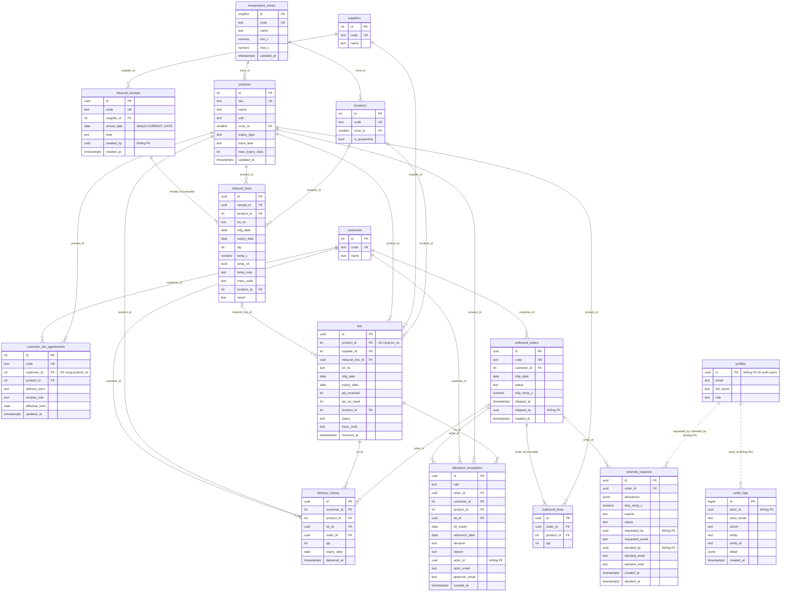

# Đối chiếu thiết kế với bảng dữ liệu thật của prototype

## 1. Nguồn đối chiếu

- **Prototype thực tế:** đọc trực tiếp catalog của Supabase project `upngghuyjvwhlxaqqqml` ngày 2026-10-03, ở chế độ chỉ đọc (`default_transaction_read_only = on`). Server Postgres **17.11**. Đọc từ `information_schema.columns`, `pg_constraint`, `pg_indexes`, `pg_policies`, `information_schema.triggers`, `pg_proc`.
- File migration tương ứng: `yccms-prototype/supabase/migrations/0001…0005`. Catalog thật **khớp hoàn toàn** với migration: cùng 16 bảng, cùng cột, ràng buộc, index, 21 policy, 6 trigger, 13 hàm.
- Thiết kế đích: [01-er-diagram-and-table-design.md](01-er-diagram-and-table-design.md).

Số dòng hiện có (sau `db:seed`):

| Bảng | Dòng | Bảng | Dòng | Bảng | Dòng |
|---|---|---|---|---|---|
| temperature_zones | 3 | inbound_receipts | 10 | delivery_history | 6 |
| locations | 12 | inbound_lines | 19 | allocation_exceptions | 0 |
| suppliers | 5 | lots | 19 | override_requests | 0 |
| customers | 5 | outbound_orders | 11 | profiles | 2 |
| products | 12 | outbound_lines | 21 | audit_logs | 1 |
| customer_sku_agreements | 15 | | | | |

## 2. Sơ đồ ER của prototype (vẽ lại từ catalog thật)

Nét `..` là cột chứa uuid người dùng nhưng **không có ràng buộc FK** trong DB thật.

## 3. Bảng ánh xạ thực thể

| Thực thể thiết kế | Bảng prototype | Đánh giá | Ghi chú ngắn |
|---|---|---|---|
| `app_users` | `profiles` | **Khác** | Đổi tên; prototype không có FK tới `auth.users`, không có `is_active`; vai trò là 1 cột |
| `roles`, `user_roles` | — (cột `profiles.role`) | **Chưa có** | 2 vai trò cố định bằng CHECK |
| `temperature_zones` | `temperature_zones` | **Khác** | Prototype giữ `min_c/max_c` ngay trong bảng (1 giá trị hiện hành) |
| `temperature_zone_versions` | — | **Chưa có** | |
| `locations`, `suppliers`, `customers` | cùng tên | **Gần giống** | Thiếu `is_active` |
| `customer_sites` | — | **Chưa có** | Chờ Q1 |
| `products` | `products` | **Khác** | Prototype giữ `expiry_type`, `near_expiry_days` trong bảng |
| `product_versions` | — | **Chưa có** | |
| `customer_sku_agreements` | cùng tên | **Khác** | Prototype: `UNIQUE (customer_id, product_id)`, không có `effective_to`, `approved_by` |
| `change_requests` | — | **Chưa có** | |
| `inbound_receipts` | cùng tên | **Khác** | Thiếu `status`, `supplier_ref`, `idempotency_key`, `confirmed_at`; `created_by` không FK; `arrival_date` có default `CURRENT_DATE` |
| `inbound_lines` | cùng tên | **Khác** | Có `trace_code` (thiết kế chuyển sang lô); thiếu `zone_version_id`, `result_reason` |
| `inbound_attachments` | — | **Chưa có** | |
| `lots` | cùng tên | **Khác** | Có `trace_code`; thiếu trạng thái `review`; `inbound_line_id` không UNIQUE; thiếu CHECK `qty_on_hand <= qty_received` |
| `lot_regulated_ids` | — (`trace_code`) | **Chưa có** | |
| `inventory_movements` | — | **Chưa có** | |
| `erp_import_batches` | — | **Chưa có** | |
| `outbound_orders` | cùng tên | **Khác** | Thiếu `site_id`, `source`, `erp_*`, trạng thái `cancelled`; có `ship_temp_c` (thiết kế tách bảng); `shipped_by` không FK |
| `outbound_lines` | cùng tên | **Giống** | Thiếu index `order_id` |
| `outbound_allocations` | — | **Chưa có** | Phân bổ chỉ còn dấu vết trong `delivery_history` và jsonb |
| `shipment_temperature_checks` | — (`outbound_orders.ship_temp_c`) | **Chưa có** | |
| `delivery_history` | cùng tên | **Khác** | Thiếu `site_id`, `allocation_id`; bất biến chỉ nhờ thu hồi quyền, chưa có trigger |
| `override_requests` | cùng tên | **Khác** | `allocations jsonb` thay bảng con; email người lập/duyệt lưu thừa; không FK người dùng; thiếu `expires_at` |
| `override_request_items` | — | **Chưa có** | |
| `allocation_exceptions` | cùng tên | **Khác** | Người duyệt chỉ có email (`approver_email`), không id; không liên kết `override_request_id` |
| `audit_logs` | cùng tên | **Gần giống** | Không FK `actor_id`, không partition, chưa chặn UPDATE/DELETE ở mức trigger |

Tổng: thiết kế có **29 bảng**. Prototype có **16**: 15 bảng giữ lại (1 giống, 4 gần giống, 10 khác), `profiles` đổi thành `app_users`, và **14 bảng chưa có** ở prototype (tính cả `app_users`).

## 4. Chi tiết từng chỗ prototype làm khác thiết kế

| # | Chỗ khác | Prototype thực tế (đã kiểm trên catalog) | Vì sao prototype làm vậy | Rủi ro nếu giữ | Cách chuyển sang thiết kế |
|---|---|---|---|---|---|
| D-01 | Người dùng không ràng buộc với Auth | `profiles.id` chỉ là PK, **không FK** `auth.users(id)` | Script setup tạo profile sau khi tạo user qua Admin API; tránh phụ thuộc schema `auth` khi chạy offline (Postgres 14 không có `auth.users`) | Xóa user ở Auth để lại profile mồ côi vẫn mang vai trò | Tạo `app_users` có FK `on delete restrict`; chép từ `profiles`; vô hiệu hóa bằng `is_active` |
| D-02 | Vai trò | `profiles.role text CHECK in ('warehouse','manager')` | Demo chỉ cần 2 vai trò | Không thêm được QA/sales/admin; một người không giữ được 2 vai trò | `roles` + `user_roles`; `app_role()` → `has_role()`; viết lại policy `manager_update` và các kiểm `= 'manager'` trong hàm SQL |
| D-03 | Cột người thực hiện không có FK | `inbound_receipts.created_by`, `outbound_orders.shipped_by`, `override_requests.requested_by/decided_by`, `allocation_exceptions.actor_id`, `audit_logs.actor_id` đều là `uuid` **không FK** | Đi cùng D-01 (không có bảng người dùng có FK để trỏ tới) | Id rác hoặc id của user đã xóa vẫn ghi được (dù hiện chỉ hàm SQL ghi, lấy từ `auth.uid()`) | Thêm FK tới `app_users` sau khi chép dữ liệu; `NOT VALID` rồi `VALIDATE` để không khóa bảng lâu |
| D-04 | Email lưu thừa | `requested_email`, `decided_email`, `actor_email`, `approver_email` (riêng `approver_email` **không có id đi kèm**) | Hiển thị nhanh, không cần join | Đổi email thì dữ liệu cũ lệch; người duyệt ngoại lệ chỉ định danh bằng email | Thay bằng FK `*_by` / `approver_id`; chỉ `audit_logs.actor_email` giữ lại làm bản chụp |
| D-05 | Cấu hình không có phiên bản | `temperature_zones.min_c/max_c`, `products.expiry_type/near_expiry_days`, `customer_sku_agreements.window_rule` sửa đè; `UNIQUE (customer_id, product_id)` | Demo chỉ cần "giá trị hiện hành"; audit trước → sau bằng trigger là đủ để nói chuyện với khách | Không đánh giá lại được quyết định cũ; không đặt trước ngày áp dụng (ADR-004) | Tạo bảng `*_versions`; dữ liệu hiện tại thành phiên bản 1 (`effective_from` = `2026-04-01` cho hợp đồng, ngày go-live cho ngưỡng); đổi UK hợp đồng; đổi mọi chỗ đọc sang hàm `*_at(date)` |
| D-06 | Không có change request | Manager `UPDATE` trực tiếp (GRANT theo cột + policy `manager_update`) | Maker-checker chỉ làm cho 日付逆転, đúng trọng tâm demo | Một người tự đổi 賞味 ↔ 消費 hoặc ngưỡng nhiệt, không ai kiểm | Thêm `change_requests` + `decide_change_request`; **thu hồi** GRANT UPDATE theo cột của `authenticated` |
| D-07 | Đề nghị ngoại lệ lưu phân bổ dạng jsonb | `override_requests.allocations jsonb` (`[{order_line_id, lot_id, qty}]`) | Nhanh, khớp đúng payload API | Không có FK: lô/dòng bị đổi thì jsonb trỏ vào thứ không còn (UI đang hiện "(lô đã thay đổi)") | `override_request_items` có FK; chép bằng `jsonb_to_recordset` |
| D-08 | Không lưu phân bổ riêng | Không có `outbound_allocations`; phân bổ chỉ còn ở `delivery_history` (sau giao) và `audit_logs.detail` | Prototype giao ngay sau khi chọn, không có bước pick riêng | Không truy được "dòng đơn nào lấy từ lô nào" theo `order_line_id`; không có chỗ ghi cảnh báo ④ đã bỏ qua | Thêm bảng; `delivery_history.allocation_id` FK; dữ liệu cũ ghép theo (`order_id`, `product_id`, `lot_id`) |
| D-09 | Mã truy xuất là 1 chuỗi, lưu 2 nơi | `inbound_lines.trace_code` **và** `lots.trace_code`; gạo gộp `産地/取引` thành 1 chuỗi | Đủ để kiểm định dạng và hiện trên màn | Không tìm theo loại mã; 2 nơi có thể lệch; không tách 産地 và 取引 (DR-TRACE-01) | `lot_regulated_ids`; tách chuỗi gạo theo `/`, dòng không tách được đánh dấu `review` |
| D-10 | Không có sổ di chuyển tồn | `lots.qty_on_hand` và `location_id` sửa trực tiếp trong hàm SQL | Đủ cho demo nhập → giao → release/scrap | Không dựng lại được tồn tại một thời điểm; không đối soát được (FE-09) | Thêm `inventory_movements`; sinh dòng mở đầu `receive` = `qty_received`, rồi `ship` từ `delivery_history`, `scrap` từ `audit_logs` |
| D-11 | Trạng thái thiếu | `lots.status` không có `review`; `outbound_orders.status` không có `cancelled`; `inbound_receipts` không có `status` | Không có luồng business-review mã bò (đang chặn nhận), không có ERP hủy đơn, không lưu nháp | Q3 không xử lý được; đơn ERP hủy không có chỗ ghi | Mở rộng CHECK; thêm cột `status` (dữ liệu cũ = `confirmed`) |
| D-12 | Nhiệt khi xuất 1 giá trị | `outbound_orders.ship_temp_c` (dải lạnh nhất của đơn) | FR-OUT-05 đầy đủ cần thông tin xe/khoang/seal chưa có | Đơn nhiều dải chỉ có 1 số đo | `shipment_temperature_checks`; chép giá trị cũ thành 1 dòng với `zone_id` = dải lạnh nhất |
| D-13 | Không ghi ngưỡng đã áp dụng khi nhập | `inbound_lines` có `temp_ok` (đúng), không có ngưỡng lúc đó | Ngưỡng chưa có phiên bản (D-05) | Màn chi tiết phiếu hiện ngưỡng **hiện hành**, có thể khác ngưỡng lúc nhận | Thêm `zone_version_id`; dữ liệu cũ trỏ phiên bản 1 |
| D-14 | `arrival_date` có default `CURRENT_DATE` | `inbound_receipts.arrival_date date default CURRENT_DATE` | Còn từ bản đầu; RPC luôn truyền ngày nên default không được dùng | Server Supabase chạy UTC: nếu ai insert không truyền ngày lúc 00:00–09:00 JST thì ra **ngày hôm qua** | Bỏ default (thiết kế: ngày nhận luôn do nghiệp vụ truyền vào, theo JST) |
| D-15 | `lots.inbound_line_id` không UNIQUE | Chỉ FK | Không cần cho demo | Về lý thuyết 1 dòng nhập sinh 2 lô | UK có điều kiện (NULL được, cho lô migration như `LOT-FRO001-X`) |
| D-16 | Thiếu CHECK chéo | Không có `qty_on_hand <= qty_received`, `min_c <= max_c` (chỉ kiểm ở BFF), `result='rejected' or location_id is not null` | Luật nằm trong hàm SQL / BFF | Ghi bằng đường khác (script, migration) có thể sai | Thêm CHECK (P4/P6) |
| D-17 | Bảng bất biến chỉ nhờ thu hồi quyền | `delivery_history`, `allocation_exceptions`, `audit_logs`: `authenticated` không có UPDATE/DELETE; role owner/service vẫn sửa được | Đủ để chặn người dùng app | Script vận hành hoặc migration lỡ tay sửa lịch sử, làm sai mốc 日付逆転 | Trigger `forbid_update_delete` cho mọi role; chỉ job lưu trữ có cờ phiên được phép xóa theo DR-RET-01 |
| D-18 | Thiếu index cho FK phía con | Chỉ có 5 index ngoài khóa: `audit_logs(created_at)`, `delivery_history(customer_id, product_id, expiry_date)`, `delivery_history(lot_id)`, `lots(product_id, expiry_date, received_at)`, `override_requests(order_id) where pending` | Dữ liệu mock vài chục dòng | Với 300.000 dòng giao, join `inbound_lines.receipt_id`, `outbound_lines.order_id`, `allocation_exceptions.order_id` sẽ quét bảng | Thêm index theo P7 trước load test |
| D-19 | Không có điểm giao, không có ERP | Không có `customer_sites`, `erp_import_batches`; đơn tạo bằng seed | Ngoài phạm vi prototype (IF-ERP-01 là Assumption) | — | Thêm khi chốt Q1 và đặc tả IF-ERP-01 |
| D-20 | `audit_logs` không partition | Bảng thường, index `created_at desc` | Dữ liệu nhỏ | 3 năm audit (DR-RET-01) làm truy vấn và xóa theo kỳ chậm | Partition theo tháng; xóa theo kỳ bằng `DETACH PARTITION` |
| D-21 | Cấu hình sửa được bằng PostgREST mà DB không kiểm giá trị | Manager có GRANT UPDATE theo cột trên `temperature_zones`, `products`, `customer_sku_agreements`. DB không có CHECK `min_c <= max_c`, "ít nhất một ngưỡng", `near_expiry_days` 0–365; CHECK `window_rule` vẫn nhận NULL. Các luật này chỉ nằm ở BFF | Sửa cấu hình là việc của manager, nên chỉ kiểm ở API | Manager gọi thẳng PostgREST đặt được ngưỡng vô lý (chặn toàn bộ nhập hàng) hoặc đưa hợp đồng đã chốt về "chưa chốt" | Thu hồi GRANT UPDATE (D-06); thêm CHECK trên bảng phiên bản; trigger chặn `window_rule` về NULL |
| D-22 | Ai có profile cũng chèn được dòng audit tùy ý | Policy `audit_insert`: chỉ ràng buộc `actor_id = auth.uid()`, còn `action`/`entity`/`detail` tự do. Test của prototype còn chèn thử `'forged'`, chỉ kiểm actor | Mở sẵn cho BFF ghi audit (`writeAudit`), nhưng cuối cùng không route nào dùng: hàm SQL và trigger tự ghi | Nhật ký có thể bị chèn dòng giả (dù đúng tên người chèn) | Thu hồi INSERT `audit_logs` của `authenticated`, bỏ `writeAudit` |
| D-23 | Nhà cung cấp lưu hai nơi | `lots.supplier_id` lặp lại `inbound_receipts.supplier_id` (qua `inbound_line_id`) | Lô migration không có phiếu nhập (ví dụ `LOT-FRO001-X`) vẫn cần NCC | Hai giá trị có thể lệch nhau | Giữ cột cho lô migration, thêm trigger: nếu `inbound_line_id` có giá trị thì `supplier_id` phải bằng NCC của phiếu |

## 5. Những chỗ prototype **giống** thiết kế (giữ nguyên khi build)

| Hạng mục | Ở prototype |
|---|---|
| Khóa: master `int`/`smallint`, giao dịch `uuid` (`gen_random_uuid()`) | Đúng P1 |
| Mã nghiệp vụ duy nhất: `code`, `sku`, `(product_id, lot_no)` | Đúng P2 |
| `delivery_history` lưu **hạn lúc giao** (`expiry_date`), không đọc lại từ lô | Đúng DR-HIST-01 |
| Index mốc 日付逆転 `(customer_id, product_id, expiry_date desc)` | Đúng |
| `allocation_exceptions_once` và index pending duy nhất của `override_requests` | Đúng |
| RLS deny-by-default + hàm `SECURITY DEFINER` + trigger toàn vẹn | Đúng ADR-001 |
| Sequence `inbound_receipt_seq` cho mã phiếu | Đúng |
| `numeric(5,1)` cho nhiệt độ, `date` cho ngày nghiệp vụ, `timestamptz` cho thời điểm | Đúng P8 |
| `window_rule` NULL = chưa chốt, không có default | Đúng BR-DELWIN-01 |

## 6. Thứ tự migration đề xuất (prototype → thiết kế)

1. **Không phá vỡ:** thêm index FK (D-18); bỏ default `arrival_date` (D-14); thêm CHECK chéo (D-16, kiểm dữ liệu trước); trigger bất biến (D-17); thu hồi INSERT `audit_logs` (D-22); trigger NCC của lô (D-23).
2. **Người dùng:** `app_users`, `roles`, `user_roles`; chép từ `profiles`; thêm FK cho cột người thực hiện (D-01..D-04). Viết lại `app_role()` → `has_role()` và chạy lại toàn bộ `db:test`.
3. **Phiên bản cấu hình + change request** (D-05, D-06, D-13, D-21); viết lại các chỗ đọc cấu hình trong 2 hàm `confirm_inbound_receipt` và `_validate_shipment`, cùng pick-plan TS.
4. **Bảng con chuẩn hóa:** `override_request_items`, `outbound_allocations`, `lot_regulated_ids`, `inventory_movements`, `shipment_temperature_checks` (D-07..D-10, D-12), chép dữ liệu cũ, rồi bỏ cột thừa (`allocations`, `trace_code`, `ship_temp_c`) ở bước riêng sau khi app đã đọc cột mới.
5. **Mở rộng phạm vi:** trạng thái mới (D-11), `customer_sites`, ERP (D-19), partition audit (D-20).

Mỗi bước là một migration riêng, có test SQL đi kèm. Bước 2–4 đổi hợp đồng của hàm SQL nên phải deploy cùng phiên bản app tương ứng.
