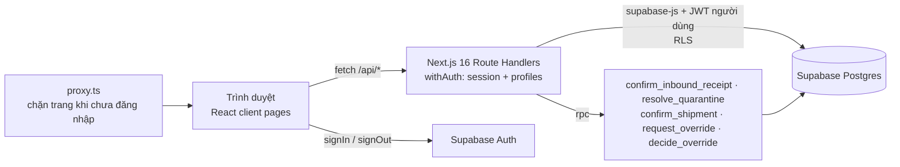
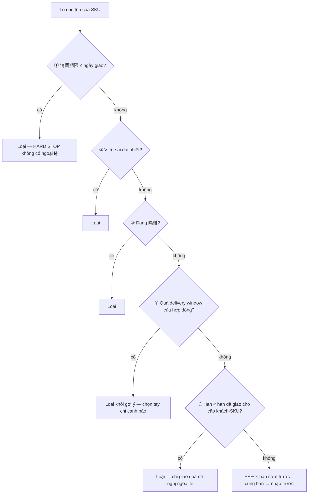
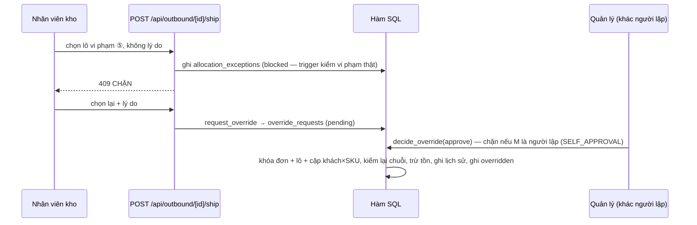

# Kiến trúc, mô hình dữ liệu & API

## 1. Kiến trúc



- **Cổng đăng nhập 2 lớp:** `src/proxy.ts` (Next 16 đổi tên middleware → proxy) chuyển mọi trang về `/login` khi chưa có session; từng API route kiểm session lại (`withAuth`) → 401, thiếu `profiles` → 403, DB không tới được → 503 kèm hướng dẫn "Resume project".
- **Không dùng service role trong app.** API gọi Supabase bằng JWT của chính người dùng → RLS áp dụng; `anon` không đọc được gì.
- **RLS** (`0002_row_level_security.sql`): đọc = người có `profiles`; quyền insert/update/delete bị thu hồi trên mọi bảng; chỉ mở hẹp: quản lý sửa đúng các cột cấu hình (`temperature_zones.min_c/max_c`, `products.expiry_type/near_expiry_days`, `customer_sku_agreements.window_rule`); ghi lượt "blocked" vào `allocation_exceptions` và `audit_logs` — trigger `stamp_actor` đóng dấu người thực hiện từ JWT, `verify_blocked_exception` tự tính lại nội dung lượt chặn (không phải vi phạm thật → `NOT_A_VIOLATION`). Ràng buộc `allocation_exceptions_once` giữ 1 lượt cho mỗi rule × đơn × lô × quyết định. Trigger `audit_config_change` (gắn trên `temperature_zones`, `products`, `customer_sku_agreements`) tự ghi audit trước → sau cho mọi sửa cấu hình, bất kể đi đường nào.
- **Ghi nghiệp vụ = 1 giao dịch SQL** qua các hàm `SECURITY DEFINER` (`0003_inbound_functions.sql`, `0004_outbound_functions.sql`) tự kiểm người gọi + luật — là chốt chặn cuối kể cả khi bị gọi thẳng bằng anon key. Hàm nội bộ `_validate_shipment` / `_perform_shipment` không cấp quyền execute cho người dùng. `confirm_inbound_receipt` chỉ nhận ngày nhận từ 7 ngày trước đến hôm nay (JST), nếu không → `INVALID_ARRIVAL_DATE`. Ngày giao dùng cho kiểm ① là max(ngày giao dự kiến, hôm nay JST).
- **Luật nghiệp vụ** thuần TypeScript ở `src/lib/rules/` (có unit test) dùng cho gợi ý và hiển thị; `src/lib/services/pick-plan-service.ts` dựng kế hoạch lấy hàng dùng chung cho màn xuất kho, màn cảnh báo, dashboard và API giao hàng.

## 2. Chuỗi loại trừ allocation (FR-OUT-02) và maker-checker





Mốc 日付逆転 = **hạn lớn nhất đã giao cho chính cặp khách-SKU** (`delivery_history`), chụp trước khi ghi lô đầu tiên của lần giao — không so với hôm nay, không mượn lịch sử khách khác. App đọc mốc này qua hàm `last_deliveries()` và số lần giao theo khách qua `customer_delivery_summary()` (cả hai ở `0005_read_functions.sql`, `SECURITY INVOKER` nên RLS vẫn áp dụng).

## 3. Bảng dữ liệu

| Bảng | Vai trò |
|---|---|
| `temperature_zones` | 3 dải nhiệt + ngưỡng do Yuki tự công bố (R-01) |
| `locations` | Vị trí lưu; `is_quarantine` cho vị trí -Q (C-Q-01, F-Q-01) |
| `suppliers`, `customers` | Nhà cung cấp; khách CUS-001…005 |
| `products` | 12 SKU (R-02): dải nhiệt, `expiry_type` (best_before \| use_by), `trace_lane` (rice \| beef \| internal_lot), ngưỡng cận hạn |
| `customer_sku_agreements` | 15 hợp đồng (R-04): điều kiện giao, `window_rule` (ONE_THIRD \| ONE_HALF \| LABEL_DATE_ONLY \| NULL = chưa chốt) |
| `inbound_receipts`, `inbound_lines` | Phiếu nhập + kết quả kiểm từng dòng (`accepted` \| `rejected` \| `hold`) |
| `lots` | Lô tồn kho; `status` (available \| quarantine \| scrapped) |
| `outbound_orders`, `outbound_lines` | Đơn xuất |
| `delivery_history` | Lịch sử giao bất biến (DR-HIST-01) — nền của 日付逆転 và truy xuất |
| `allocation_exceptions` | Nhật ký bất biến: lượt chặn BR-DATE-01 / BR-EXP-02 và ngoại lệ đã duyệt (`decision` = `blocked` \| `overridden`) |
| `override_requests` | Đề nghị ngoại lệ 日付逆転 (pending → approved / rejected / cancelled), người lập ≠ người duyệt; index duy nhất: mỗi đơn tối đa 1 đề nghị `pending`; `cancelled` = đơn đã giao bằng đường khác |
| `profiles` | Vai trò người dùng (`warehouse`, `manager`), khóa = `auth.users.id` |
| `audit_logs` | Nhật ký thao tác append-only |

## 4. API

| Method & path | Mô tả |
|---|---|
| `GET /api/me` | Hồ sơ + vai trò người đang đăng nhập |
| `GET /api/dashboard` | KPI tổng quan |
| `GET /api/master` | NCC, SKU, vị trí (kèm -Q), dải nhiệt (cho form) |
| `GET /api/inbound` · `POST /api/inbound` | Danh sách phiếu · tạo & kiểm phiếu (422 kèm danh sách lỗi) |
| `GET /api/inbound/[id]` | Chi tiết phiếu |
| `GET /api/inventory?view=all\|near\|quarantine&zone=` | Tồn kho, cận hạn, 隔離 |
| `POST /api/lots/[id]/quarantine` | Release / scrap lô 隔離 (quản lý) |
| `GET /api/outbound` | Đơn + tóm tắt kiểm trước |
| `GET /api/outbound/[id]` | Kế hoạch lấy hàng: chuỗi loại trừ từng lô, FEFO, hợp đồng, mốc 日付逆転, đề nghị đang chờ |
| `POST /api/outbound/[id]/ship` | Xác nhận giao; 日付逆転 không lý do → 409; có lý do → tạo đề nghị ngoại lệ |
| `POST /api/override-requests/[id]/decision` | Duyệt / từ chối đề nghị (quản lý khác người lập) |
| `GET /api/alerts/date-reversal` | Dòng đơn có rủi ro, hàng chờ duyệt, nhật ký ngoại lệ |
| `GET /api/customers` · `GET /api/customers/[id]` | Khách + hợp đồng · lịch sử giao (lọc SKU/kỳ) |
| `PATCH /api/agreements/[id]` | Chốt delivery window (quản lý) |
| `GET /api/settings` · `PATCH /api/settings/zones/[id]` · `PATCH /api/settings/products/[id]` | Ngưỡng nhiệt, master SKU (quản lý) |
| `GET /api/trace?lot=` · `?customer=` | Truy xuất xuôi / ngược |
| `GET /api/audit?action=` | Audit log |

## 5. Cấu trúc thư mục

```
yccms-prototype/
├── src/proxy.ts                 # cổng đăng nhập
├── src/app/login/               # SCR-00
├── src/app/(app)/               # các màn hình (client pages, gọi /api/*)
├── src/app/api/                 # Route Handlers → Supabase
├── src/lib/api/                 # withAuth, ánh xạ mã lỗi RPC → thông báo
├── src/lib/client/              # use-api (fetch phía trình duyệt), định dạng hiển thị
├── src/lib/rules/               # chuỗi loại trừ, delivery window, nhiệt độ, truy xuất + unit test
├── src/lib/services/            # pick plan, kiểm phiếu nhập, kiểm giao hàng
├── src/lib/supabase/            # client server/browser, phát hiện mất kết nối
├── src/components/              # UI dùng chung
├── supabase/migrations/         # 0001 schema · 0002 RLS · 0003 nhập kho · 0004 xuất kho · 0005 hàm đọc
├── supabase/seed/               # dữ liệu mock theo fixture RFP
├── supabase/tests/              # test hồi quy SQL (npm run db:test)
├── scripts/                     # setup-database.mjs (db:setup/db:seed), run-sql-tests.mjs (db:test)
├── e2e/                         # Playwright E2E theo kịch bản demo (npm run test:e2e)
└── docs/                        # tài liệu
```
