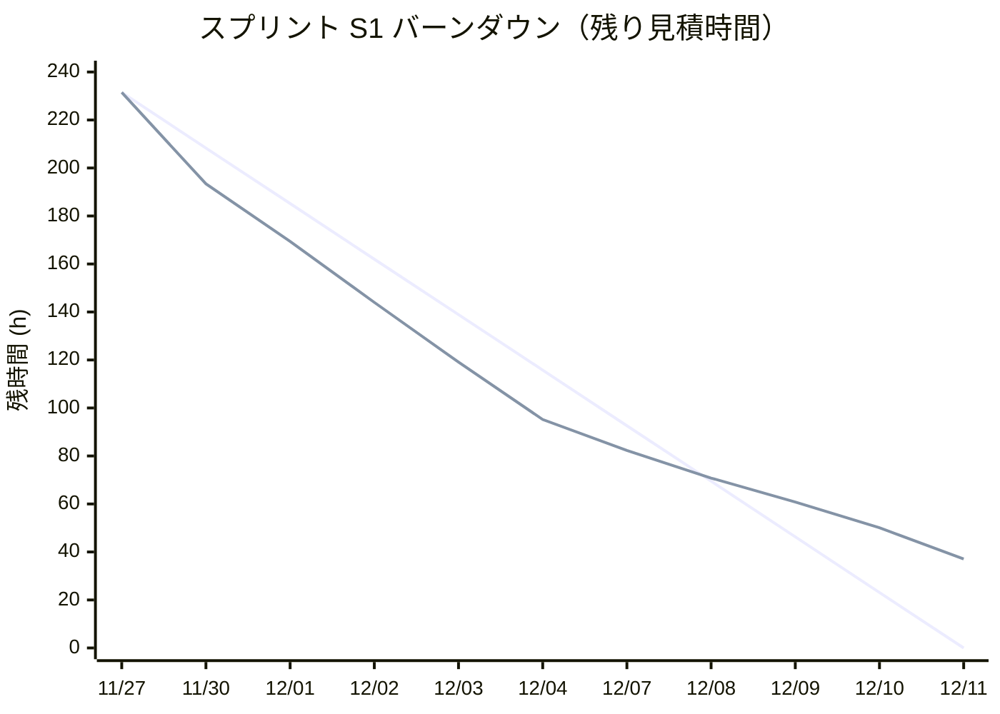

# スプリント報告書（スプリント S1：2026-11-30〜2026-12-11）【シミュレーション】

> **本報告書は、開発フェーズ最初の 2 週間を想定したシミュレーションです。** 数値はすべて模擬データであり、実際の作業実績ではありません。前提：M-01〜M-03 は計画どおり完了、体制は仮定（バックエンド 2 名・フロントエンド 2 名、1 人 1 日 6.5 時間の実稼働）、見積は承認済みベースライン（`schedule.md` v1.0、`task-list.md`）。

## 1. 報告情報

| 項目 | 内容 |
| --- | --- |
| 報告期間 | 2026-11-30 – 2026-12-11（スプリント S1、10 営業日） |
| 作成者 | PM（仮）— pm-report-project skill |
| 作成日 | 2026-12-11（シミュレーション上の基準日。実作成日 2026-10-03） |
| GitHub Project | [sun-thanhta / Project #3](https://github.com/users/sun-thanhta/projects/3)（ステータス・実績時間・残時間を本シミュレーションの値で更新済み） |

## 2. 今週の要約

- **遅延見込み**：S1 の計画 231.5h（29 SP、ストーリー 7 件）のうち **37.1h（16%）が未消化**となり、E-02-S02（SKU マスタ）と E-04-S01（温度帯しきい値の版管理）を S2 へ持ち越します。
- 原因は**バックエンドの能力不足**です。BE 2 名は稼働率 100% でしたが、FE は約 50% にとどまりました。また DB・SQL タスクが見積より 10〜30% 増加しました。現在の仮定体制では M-04（開発完了 2027-02-26）に間に合わない見込みで、**増員または範囲の優先順位付けのご相談**をお願いします。
- 完了：ログイン・権限・監査ログ（E-01-S01〜S03）、基礎データ（E-02-S01）、設定の版管理＋変更申請（E-02-S03）の 5 ストーリー（17 SP）。実績 192h。

## 3. 進捗状況

### 3.1 ストーリー別

| ID | 内容 | ステータス | 進捗率 | 見積(h) | 実績(h) | 残(h) | コメント |
| --- | --- | --- | --- | --- | --- | --- | --- |
| [#2](https://github.com/sun-thanhta/freezer-warehouse/issues/2) E-01-S01 | ログイン・アクセスゲート | 完了 | 100% | 20 | 12.0 | 0.0 | P0 の基盤を流用し見積の 60% で完了 |
| [#5](https://github.com/sun-thanhta/freezer-warehouse/issues/5) E-01-S02 | ロール・RBAC 基盤 | 完了 | 100% | 16 | 9.6 | 0.0 | 同上 |
| [#8](https://github.com/sun-thanhta/freezer-warehouse/issues/8) E-01-S03 | 追記専用（append-only）監査ログ | 完了 | 100% | 52 | 54.4 | 0.0 | 監査ログ DB は見積 +10% |
| [#14](https://github.com/sun-thanhta/freezer-warehouse/issues/14) E-02-S01 | 基礎データ（仕入先・顧客・納品先・ロケーション（-Q））＋ RFP フィクスチャ | 完了 | 100% | 24 | 24.0 | 0.0 | BE開発者B が引き取り、BE開発者A の負荷を分散 |
| [#17](https://github.com/sun-thanhta/freezer-warehouse/issues/17) E-02-S02 | SKU マスタ（期限種別（賞味/消費）・期限接近しきい値・トレーサビリティレーン） | 進行中 | 44% | 52 | 22.8 | 29.2 | **S2 へ持越し**：画面は完了、DB・API が未完 |
| [#21](https://github.com/sun-thanhta/freezer-warehouse/issues/21) E-02-S03 | 設定のバージョン管理＋メーカー・チェッカー型変更申請（ADR-004） | 完了 | 100% | 32 | 41.6 | 0.0 | 見積 +30%（ADR-004 の版管理が想定より複雑）だが完了 |
| [#50](https://github.com/sun-thanhta/freezer-warehouse/issues/50) E-04-S01 | 3温度帯しきい値の版管理（Yuki 自社基準） | 進行中 | 78% | 35.5 | 27.6 | 7.9 | **S2 へ持越し**：E-02-S03 完了待ちで DB 着手が 12/10。画面はモックで先行完了 |
| 合計 | S1 全体 | — | 84% | 231.5 | 192 | 37.1 | 完了 17/29 SP（ストーリー単位）、タスク 14/18 件完了 |

### 3.2 マイルストーン

| ID | 内容 | ステータス | コメント |
| --- | --- | --- | --- |
| M-01〜M-03 | キックオフ・要件・基本設計サインオフ | 完了 | 計画どおり（シミュレーション前提）。ただし Q1・Q2・Q4・Q5 は未回答 |
| M-04 | 開発完了（2027-02-26） | 進行中・**遅延見込み** | §6 リスク 1・2 を参照 |

### 3.3 バーンダウン（見積時間ベース）

1 本目＝理想線、2 本目＝実績線（11/27 はスプリント開始時点）。前半は P0 基盤の流用と FE のモック先行で理想より速く減少したが、12/08 以降はバックエンド待ちで減少が鈍化し、37.1h が残った。

| 日付 | 理想残(h) | 実績残(h) | 累計実績(h) | 出来事 |
| --- | --- | --- | --- | --- |
| 11/27（開始） | 231.5 | 231.5 | 0 | |
| 11/30 | 208.3 | 193.4 | 26 | E-01-S01・S02 の主要タスク完了（P0 基盤を流用） |
| 12/01 | 185.2 | 169.4 | 48 | BE開発者A が開発環境の是正に 4h（Colima のポート公開設定）。BE開発者B が T-008 を引き取り |
| 12/02 | 162 | 144 | 74 |  |
| 12/03 | 138.9 | 119.1 | 100 | FE が画面をモックで先行（T-007・T-012 完了） |
| 12/04 | 115.8 | 95.2 | 126 |  |
| 12/07 | 92.6 | 82.3 | 140 | E-01-S03 完了。BE開発者A は E-02-S03（T-013）に着手 |
| 12/08 | 69.5 | 70.8 | 153 | E-02-S01 完了。DB T-010 の着手がここまでずれ込む |
| 12/09 | 46.3 | 60.8 | 166 |  |
| 12/10 | 23.1 | 50.1 | 179 | E-02-S03 完了（見積 +30%）。E-04-S01 の DB 着手 |
| 12/11 | 0 | 37.1 | 192 |  |

### 3.4 稼働時間（担当者別）

| 担当者（仮） | 稼働可能(h) | 実績(h) | 稼働率 | 備考 |
| --- | --- | --- | --- | --- |
| BE開発者B（仮） | 65 | 65.0 | 100% | T-008・T-010 を引き取り |
| FE開発者A（仮） | 65 | 32.5 | 50% | 手空き時間 約 32h |
| BE開発者A（仮） | 61 | 61.0 | 100% | 開発環境是正 4h を除く |
| FE開発者B（仮） | 65 | 33.5 | 52% | 手空き時間 約 32h |
| 合計 | 256 | 192 | 75% | |

## 4. 今週の成果

- 完了ストーリー（5 件）：E-01-S01 ログイン・アクセスゲート、E-01-S02 ロール・RBAC 基盤、E-01-S03 監査ログ（追記専用）、E-02-S01 基礎データ＋RFP フィクスチャ、E-02-S03 設定の版管理＋変更申請。
- 完了タスク：14/18 件（T-001〜T-009、T-012〜T-015、T-034）。各タスクの詳細は GitHub Issue と Project #3 を参照。
- 画面は E-02-S02・E-04-S01 ともモックで完成済みで、S2 で API と結合します。

## 5. 来週（S2：2026-12-14〜12-25）の予定

- **持越し 37.1h を最優先**：E-02-S02 の DB（T-010）・API（T-011）、E-04-S01 の DB（T-032）・API（T-033）。E-04-S01 は S2 の入荷検品（E-03-S01）の前提のため、S2 前半で完了させます。
- S2 計画分：E-02-S04（顧客×SKU 契約）、E-03-S01〜S04（入荷検品）、E-04-S02〜S04（在庫・隔離）。計画のバックエンド 206.5h に持越しを加えると約 243h で、BE 2 名の能力（約 130h）を大きく超えるため、**S2 開始前に範囲の優先順位を確定**します（§7）。
- E-01 の結合テスト（E-01-T01〜T03、2026-12-14〜12-25）を開始します。
- FE の手空き時間は、S2 画面の前倒しと E2E テストの整備に充てます。

## 6. 課題・リスク

> 課題・リスク台帳（`risks-problems/`）は未作成のため ID は未採番です。`pm-track-risks-issues` で登録します。

| ID | 内容 | ステータス | 対応 |
| --- | --- | --- | --- |
| （未採番）リスク 1 | **バックエンド能力不足**：S2 約 243h、S3 約 307h の需要に対し、仮定体制（BE 2 名）の能力は約 130h/スプリント。コア機能だけでも S2〜S6 の能力（約 650h）を約 120h 超過（見積偏差 +15% 込みで約 770h） | 発生中（影響：大） | BE を 2 名程度増員、または仮ストーリー（E-09〜E-13）の範囲・時期の見直し。FE の余力を API・テストに一部振り替え |
| （未採番）リスク 2 | **DB・SQL タスクの見積偏差**：S1 で +10〜30%（E-02-S03 +30%、E-01-S03 +10%） | 発生中 | S2 以降の DB タスクに +15% のバッファを見込み、見積を再確認 |
| （未採番）リスク 3 | **お客様確認事項の未回答**：Q1（日付逆転を顧客単位か店舗単位か）、Q2（基準＝最終納品か最大期限か）、Q4（承認の段数）が M-02（10/30）から未回答 | 継続 | S3（2027-01-04 開始）の出荷・日付逆転に直結。12/18 までの回答をお願いしたい（§7） |
| （未採番）リスク 4 | **設計書の不整合**：入荷時に適用するしきい値の版（SCR-07 は確定時点、ADR-004 は入荷日） | 継続 | S2 の E-03-S01 着手（12/14）前にテックリードが決定し、設計書を修正 |
| （未採番）リスク 5 | **環境**：開発はローカルのみ（ADR-006）。性能テスト・UAT 用の環境方針（QA-001・QA-002）が未回答 | 継続 | M-06（2027-04-02）に影響。1 月末までにご方針をいただきたい |
| （未採番）課題 1 | 開発環境の設定漏れ（Colima のポート公開設定）で 4h の損失 | 解決済み | 手順書の初回セットアップ手順に従うことを周知（`docs/00-development/local-development-setup.md`） |

## 7. 決定事項・確認事項

- 決定事項：なし（`decision.md` 未作成）。以下は社内決定が必要な事項です。
  1. **体制増強または範囲調整**（リスク 1）：BE 増員の可否、または仮ストーリーの後ろ倒し。S2 開始（12/14）前に判断が必要。
  2. 入荷時しきい値の適用基準（リスク 4）。
- お客様へのご確認のお願い：
  1. Q1・Q2・Q4 のご回答（12/18 まで）。
  2. Q5：AGR-008／AGR-014 の納品期限ルールの確定時期（現在は未確定のまま業務レビュー扱い）。
  3. 性能テスト・UAT 環境のご方針（QA-001・QA-002）。

## 8. その他共有事項

- GitHub Project #3 の S1 対象 Epic 3・ストーリー 7・タスク 18 件に、本シミュレーションのステータス・実績時間・残時間・担当者（引き取り後）を反映しました（項目「シミュレーション」に「S1 模擬実績」と記載）。
- Project の自動化「Auto-close issue」により、ステータスが Done になった 19 件の Issue が自動クローズされたため、**すべて再オープン**しました（実際の作業は未着手のため。各 Issue に理由をコメント）。ボード上のステータスはシミュレーション値のままです。シミュレーションを取り消す場合は、ステータス・実績時間・残時間を初期値に戻すスクリプトを用意しています。
- 本報告の数値は仮定体制・模擬データに基づくため、実際の体制（`stakeholders.md`）確定後に再計算が必要です。
